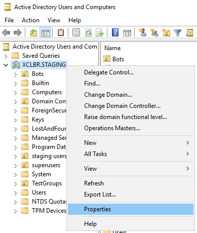
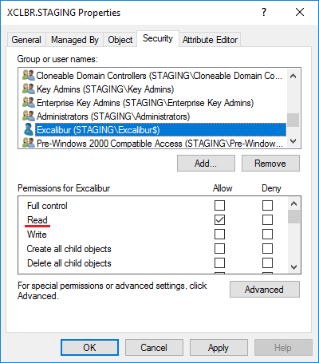
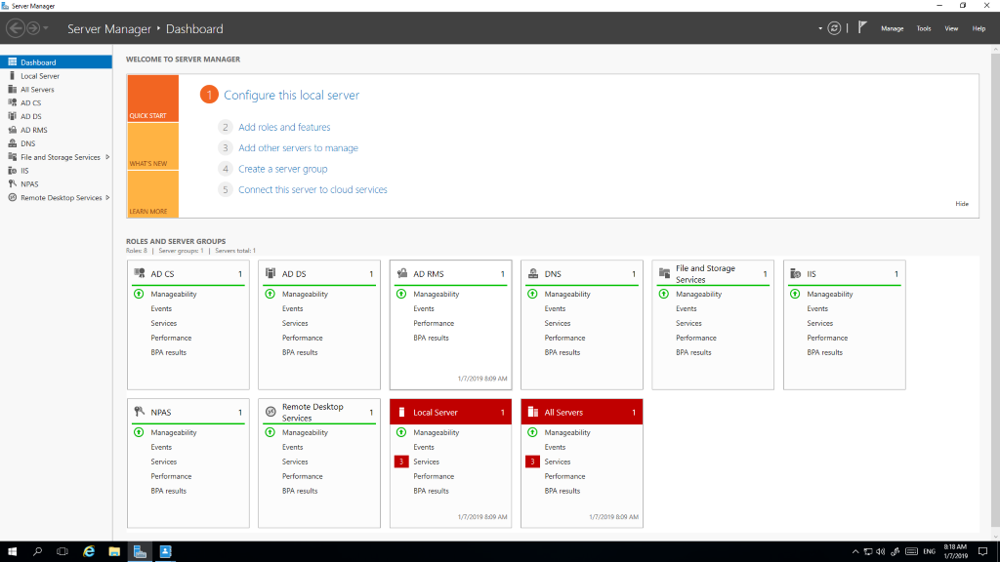

# Excalibur AD Facade Manual

Version 1.3

## Introduction 

### Glossary 

This document uses the following terms:

**Excalibur AD Facade**         Excalibur Active Directory Facade component (part of Excalibur product)

**AD**         Active Directory

**DC**         Domain Controller

**LDAP**         Lightweight Directory Access Protocol

**DRSR Microsoft’s**         Directory Replication Service Remote Protocol

**Sid**         Security identifier

**objectGUID**         Object’s globally unique identifier

**DC**         Domain Controller

**MSA**         Managed Service Account

**gMSA**         Group Managed Service Account

**SCM**         Service Control Manager

**GUI**         Graphical User Interface

**OU**         Organizational Unit

### Overview 

Excalibur Active Directory Facade (Excalibur AD Facade) is one of Excalibur product components, which is deeply integrated into Active Directory (AD), through LDAP v3 protocol and Microsoft Directory Replication Service (DRS) Remote Protocol.

Excalibur AD Facade connects to Excalibur Server via secure mutually authenticated WebSocket channel. Thus, there is no security risk of malicious software to connect to Facade and compromise Active Directory. Excalibur Server cannot connect to Excalibur AD Facade, only Excalibur AD Facade to Excalibur Server - notice the one-directionality.

Excalibur AD Facade provides ability to query basic information about AD Users, Computers and their Groups for Excalibur. Facade does not manipulate data in AD in any way. No create, modify or delete operations are possible. Facade performs verification of information received in requests against AD (such as user / computer name, Sid, objectGUID etc.) and finally - performs cryptographic (PKI multi-signature) operations essential for Excalibur to work properly, guaranteeing overall system soundness and integrity.

## Excalibur AD Facade installation

Excalibur AD Facade is shipped as signed Windows installer package (\*.msi), which is preconfigured for each company. When installing Excalibur AD Facade installer package must be run under account with elevated privileges (domain Administrator) and on a computer, that is domain joined.

### Installation on Active Directory Domain Controller

Simplest solution is to install Excalibur AD Facade directly on the Active Directory server running Microsoft Windows Server 2008 R2 or newer. In that case Excalibur AD Facade service is running under Local System account with all required permissions, thus no additional configuration is necessary.

After running Excalibur AD Facade installer package, familiar “Welcome” dialog will pop-up. Simply proceed to the next step by clicking on the “Next” button.

 

In the next step accepting license agreement is required, before continuing. To proceed next in the installation process, choose “I accept the terms in the license agreement” and click “Next”.

 

In the next step choose “Local System Account” option and click “Next” button.

 

After this step, dialog with installation progress is displayed. After installation Excalibur AD Facade is installed and running already.

#### Installation on domain joined computer 

##### Installation under domain account

Excalibur AD Facade can in theory be installed on domain joined computer, under domain account, in a similar manner as under Managed Service Account, but it is not recommended due to the following reasons:

-   When using a normal domain account as a service log on account, every time password is expired, Administrator must set a new password for account and login again with new password into domain joined computer running Excalibur AD Facade. Meanwhile Excalibur AD Facade will not work properly.
-   Issue described above can be avoided by setting acomplex password to the domain account and disabling its password expiration, which we also consider as a security risk.
-   In case Excalibur AD Facade service will logon as domain account, credentials to that account must be entered during installation and provided to Service Control Manager (SCM). Even though SCM holds password stored in a secure portion of the  registry for normal domain account, it is nevertheless subject to attack.

We strongly recommend installing Excalibur AD Facade with Group Managed Service Account configured as its logon account.

When installing Excalibur AD Facade to log on as a regular domain account, account must have Log on as a Service right.

##### Installation under Group Managed Service Account

To avoid security issues mentioned in the previous section, Microsoft has introduced Active Directory Group Managed Service Accounts (gMSA’s), which are some sort of combination of computer and user account.

Key features of gMSA are:

-   No password management is required. gMSA uses a complex, random, 120-characters long password and change it automatically when it     reaches the domain or computer password expiration date. 
-   gMSA’s cannot be used for interactive logons.
-   gMSA can be used only with the set of computers specified during its creation.

Installing Excalibur AD Facade on domain joined computer, which is not Active Directory Domain Controller (DC), under Managed Service Account requires few additional configuration steps. In this scenario the target computer must be running Microsoft Windows Server 2008 R2 or Microsoft Windows 7 SP1 Professional / Enterprise edition and newer.  

For gMSA creation no GUI exists. Instead Windows PowerShell command prompt must be used. To create AD gMSA for Excalibur AD Facade on an AD server, Active Directory module for Windows PowerShell (part of Remote Server Administration Tools (RSAT)) must be installed first. If already installed, you can skip the next step.

###### Installing Active Directory module for Windows PowerShell on Active Directory server

On Microsoft Windows Server 2016 open **Server Manager** application. In application menu click **“Manage”** and in submenu click **“Add roles and features”** 

 

In the **“Add roles and features Wizard”** click on the **“Next”** button until on the “Features”  page. On the “Features” page make sure **“Active Directory module for Windows PowerShell”** (under Remote Server Administration Tools -\> AD DS and AD LDS Tools) is checked.

 

 

 

 

 

To install this feature, proceed with the **“Next”** button to the **“Confirmation”** page and commit with the **“Install”** button.

Check the installation result for success.

To install this feature on Windows Server which is not Windows Server 2016, follow instructions on Microsoft support page:

[https://support.microsoft.com/en-us/help/2693643/remote-server-administration-tools-rsat-for-windows-operating-systems](https://www.google.com/url?q=https://support.microsoft.com/en-us/help/2693643/remote-server-administration-tools-rsat-for-windows-operating-systems&sa=D&ust=1596446730092000&usg=AOvVaw3BzcMkNGVxQFJ3zlFIcZPs) 

###### Creating Group Managed Service Account in Active Directory

As mentioned earlier in this manual, gMSA’s can be created only by using Windows PowerShell command prompt. Command prompt must be run under elevated privileges (domain Administrator).

Before creating gMSA on AD DC, importing Active Directory module for Windows PowerShell is required with the following command.

 

After successful module import, gMSA can be added by running the following command in the PowerShell console.

 

-   **Name** parameter should be account name, that will be simple to identify within AD. After creation gMSA is automatically suffixed with \$ (dollar sign) and used as sAMAccountName for newly created gMSA.  
-   **DNSHostName** is required to create gMSA instead of simple MSA. This parameter should be FQDN of DC, where gMSA is created.
-   **PrincipalsAllowedToRetrieveManagedPassword** is a comma separated set of machine FQDN’s allowed to use this gMSA.
-   **Enabled** flag simply tells cmdlet to enable gMSA after creation

Whole documentation to the New-ADServiceAccount cmdlet can be found [here](https://www.google.com/url?q=https://docs.microsoft.com/en-us/powershell/module/addsadministration/new-adserviceaccount&sa=D&ust=1596446730096000&usg=AOvVaw1rYJPmJ_I5YqrrModfbB35).

###### Configure required permissions for Group Managed Service Account

Excalibur AD Facade requires permissions for replicating changes from AD. Replicating changes enables Excalibur AD Facade to collect information about organizational units, where user objects are stored and about user groups as well. This information is sent to Excalibur Server and subsequently used in Excalibur Dashboard for inviting users, creating groups, policies etc. It is necessary for Excalibur to work properly thus it is a must.

Excalibur AD Facade also requires permission to replicate all changes from AD. This permission is used during validating account credentials. Instead of passwords, NTLM hashes are sent to facade and are compared against replicated NTLM hashes from AD. NTLM hashes are NOT stored by facade. Hashes are replicated only for time required to validate an account.

To configure these permissions for gMSA, open Active Directory Users and Computers administrative tool on AD DC. After launch, make sure “Advanced Features” under “View” menu is checked for advanced features became available during configuration.

Next invoke context menu by right-clicking on the root of your domain and select “Properties”.

 

In the “Properties” dialog navigate to the “Security” tab and click on “Add…” button.

 

In the displayed dialog for selecting security objects click “Object Types…” button.  

 

In dialog “Object Types” make sure “Service Accounts” is checked. And confirm with the “OK” button. This will ensure that in the next step checking names will search specified account name in service accounts as well.

Next, write the name of the created gMSA into “Enter the object names to select” field (in this manual we created gMSA with name “Excalibur”) and click on “Check Names” button.

After “Check Names” is clicked, name of gMSA should be automatically changed to one found, in this case “Excalibur\$”. Make sure gMSA account is suffixed with dollar sign, as mentioned before, this is the identifier for managed service accounts and dollar sign is automatically suffixed during account creation.

In case multiple accounts with a name similar to “Excalibur” is found, following dialog should appear.

 

Just make sure to select one with a dollar sign suffixed Logon Name and click on the “OK” button.

After success gMSA should appear in the security object list. Select gMSA within the list and in Permissions list below make sure to check Allow on “Read” permission.

Scroll permissions list down and check allow on “Replicating Directory Changes” and “Replicating Directory Changes All” permissions as well. 

Click on the “Apply” button then click “OK”. Created gMSA will now have sufficient rights for Excalibur AD Facade to work properly.

###### Installing Group Managed Service Account on target computer 

Before installing gMSA on the target computer, Active Directory module for Windows PowerShell (RSAT) must be installed.

Before installing gMSA, importing Active Directory module for Windows PowerShell in PowerShell command prompt is required with the following command.

 

After successful import, run the following command to install gMSA on the target computer. Provide “Identity” parameter with the same name of gMSA, that were created on AD DC.

 

Test gMSA by running the following command. Result should be \$True in case everything is configured properly.

 

###### Running Excalibur AD Facade installer package {#h.489dwmfo7imu .c22}

After running Excalibur AD Facade installer package on target machine, familiar dialog will pop-up. Simply proceed to the next step by clicking on the “Next” button.
 

In the next step accepting license agreement is required, before continuing. To proceed to the next in installation process, choose “I accept the terms in the license agreement” and click on the “Next”. 

 

On the next dialog choose the “Group Managed Service Account” option. Enter gMSA name (down-level logon name in form DOMAIN\\Account\$) into “Account name” field. Don’t forget to write gMSA name suffixed with \$ (dollar sign). Double check gMSA name is correct and proceed with the“Next” button to the next dialog.

 

Step over this dialog by hitting “Install” button.

 

After successful installation “Completed” dialog will appear with information about successful installation. To close the wizard, click on the “Finish” button.

 

At this moment, when installation was successful, Excalibur AD Facade is installed and running. This can be checked in “Services” tool, that Excalibur AD Facade service is installed, in running state and logged on as created gMSA.

### Facade runs but doesn’t connect 

Facade starts under gMSA and sometimes is launched earlier than Active Directory. SCM tries to launch service, but can’t verify service account (event viewer shows that account has not been found) and doesn’t allow it. To resolve this problem, reboot the facade.

### Enable / Disable interactive Ctrl+Alt+Del logon  

#### Global enabling / disabling 

To globally enable / disable of required Ctrl+Alt+Del logon, login to server and launch Server manager.

Click on the Tools on right side and select Group Policy Management

 

Find the Default Domain policy of your domain on the left side, right click on Default Domain policy and select Edit. New window shows up.

 

Execute double click on Computers Configuration \> Policies \> Windows Settings \> Security Settings \> Local Policies \> Security Options  

There is a list of security options. Find “Interactive logon: Do not require Ctrl+Alt+Del” and open it. If it is necessary to disable Ctrl+Alt+Del logon, set it for Enable. If it is necessary to enable Ctrl+Alt+Del logon, set it Disable.

By default, changes will be applied after reboot of server / pc client. If is necessary to apply changes without reboot, launch command prompt on server, and run the following command:

*“gpupdate /force”*

After successful loading of policies, run this command on the PC client too.