# Excalibur Administrator’s Dashboard Manual with PAM

Version 1.4.12

<!-- vscode-markdown-toc -->
1. [Logging in](#Loggingin)
2. [Introduction](#Introduction)
3. [Sections](#Sections)
4. [Sections Summary](#SectionsSummary)
	4.1. [Overview](#Overview)
	4.2. [Groups](#Groups)
	4.3. [Security](#Security)
	4.4. [Status](#Status)
5. [General](#General)
	5.1. [Overview](#Overview-1)
	5.2. [Users](#Users)
		5.2.1. [User: Account Detail, Sessions](#User:AccountDetailSessions)
		5.2.2. [User: Actions](#User:Actions)
		5.2.3. [ User: Incidents](#User:Incidents)
		5.2.4. [User: Tokens](#User:Tokens)
		5.2.5. [User: Computers](#User:Computers)
		5.2.6. [User: PAM](#User:PAM)
		5.2.7. [User: Accounts](#User:Accounts)
		5.2.8. [User: Policies](#User:Policies)
		5.2.9. [User: Groups & Roles](#User:GroupsRoles)
		5.2.10. [User: Subordinates](#User:Subordinates)
		5.2.11. [User: Locations](#User:Locations)
	5.3. [Timeline](#Timeline)
	5.4. [Actions](#Actions)
		5.4.1. [Registration](#Registration)
		5.4.2. [Authentication](#Authentication)
		5.4.3. [Authorization](#Authorization)
		5.4.4. [Factors Reset](#FactorsReset)
		5.4.5. [Verification](#Verification)
		5.4.6. [Tokenless Authentication](#TokenlessAuthentication)
		5.4.7. [Show Password](#ShowPassword)
		5.4.8. [Set geofence](#Setgeofence)
	5.5. [Sessions](#Sessions)
	5.6. [Computers](#Computers)
	5.7. [Components](#Components)
	5.8. [PAM](#PAM)
		5.8.1. [Resources](#Resources)
		5.8.2. [List](#List)
		5.8.3. [File transfers](#Filetransfers)
		5.8.4. [Fulltext search](#Fulltextsearch)
	5.9. [SAML Service Providers](#SAMLServiceProviders)
6. [Groups](#Groups-1)
	6.1. [Groups: Users](#Groups:Users)
	6.2. [Groups: Computers](#Groups:Computers)
	6.3. [Groups: Geofences](#Groups:Geofences)
7. [Security](#Security-1)
	7.1. [Roles](#Roles)
	7.2. [Security policies](#Securitypolicies)
	7.3. [Incidents](#Incidents)
		7.3.1. [Incidents Notifications](#IncidentsNotifications)
	7.4. [Verifications](#Verifications)
	7.5. [Geofences](#Geofences)
	7.6. [Audit](#Audit)
	7.7. [Notifications](#Notifications)
8. [Status](#Status-1)
	8.1. [Configuration](#Configuration)
	8.2. [Versions](#Versions)
	8.3. [Updater](#Updater)
	8.4. [Logger](#Logger)

<!-- vscode-markdown-toc-config
	numbering=true
	autoSave=true
	/vscode-markdown-toc-config -->
<!-- /vscode-markdown-toc -->

##  1. Logging in

To log into the Excalibur Dashboard, please use your initialized Excalibur mobile app. You will be logged in automatically after all authentication factors are successfully verified.

##  2. Introduction

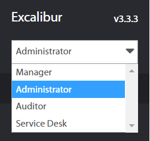

In spite of the fact that User might have a multiple User roles, everyone who is logged into the Dashboard, is logged under the User role by default. Regular User only sees own Actions and Sessions. A deployed Excalibur always has at least one User with the Administrator role assigned.

In Dashboard User Interface (UI) in the top left corner, there is a drop-down menu to choose among different User Roles assigned to the User. Each Role implies its own range of capabilities available in the Dashboard.

This manual is focused on capabilities available to the Administrator role only.

##  3. Sections

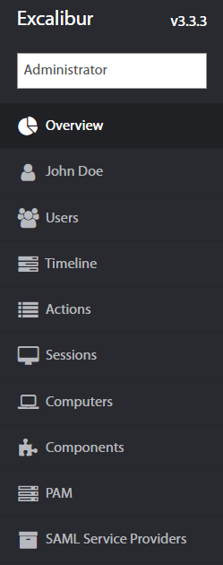

Dashboard functionality is organized into logical sections to make navigation easier. General section includes the following pages:

- Overview
- Users
    - Sessions
    - Actions
    - Incidents
    - Tokens
    - Computers
    - Accounts
    - Policies
    - Groups
    - Roles
    - Subordinates
    - Locations
    - Timeline

- Actions
    - All
    - Authentication
    - Authorization
    - Verification
    - Registration
    - Factor reset
    - Tokenless authentication
    - Show password
    - Set geofence

- Sessions
    - Logged
    - Active
    - History
    - Manual

- Computers
- Components
- PAM
- SAML Service Providers

Groups section includes:

-   Users
-   Computers
-   Geofences

At the bottom next to the Login button there is a countdown timer. User is logged out after 15 minutes of inactivity.

Security section includes:

- Roles
- Security policies
- Incidents
    - All
    - Critical
    - High
    - Medium
    - Low
    - Notifications
- Verifications
    - All
    - Authentication
    - Authorization
    - Etc.. /other actions/

- Geofences
- Audit
- Notifications

Status section includes:

- Configurations
- Versions
- Windows
- MacOS
- Android
- iOS
- Updater
- Logger

##  4. Sections Summary

###  4.1. Overview

- Users - List of all Active Directory users with Excalibur app installed and registered into Excalibur.
- Timeline - Summary view of users activity during a given day.
- Actions - List of all actions took by every user.
- Sessions - List of all logged, active, and manual sessions, as well as their history.
- Computers - List of all computers with their names, Excalibur version, OS and current status information.
- Components - List of all currently deployed Excalibur components and their versions.
- PAM - List of all PAM resources, which are available for users
- SAML Service Providers - Page where SAML is uploaded

###  4.2. Groups

- Users - List of all groups of users created in Excalibur.
- Computers -  List of all computers groups created in Excalibur.
- Geofences - List of all groups of geofences created in Excalibur.

###  4.3. Security
- Roles - List of all roles from the company's Active Directory.
- Security policies -  Page to view, edit, add or remove individual policies.
- Incidents - Lists of all registered incidents in Excalibur.
- Verifications - List of all verifications that happened or are currently happening in Excalibur.
- Geofences - Page which serves to manage existing and create new geofences in Excalibur.
- Audit - List of all changes in Excalibur dashboard divided into tabs
- Notifications - Page to set email notification

###  4.4. Status
- Configurations- Page to set email notification
- Versions -  List of all Operating System (OS) versions, Statuses andExcalibur versions (version of a respective component) of every device in Excalibur ecosystem, as well as a summary of all versions currently used.
- Updater - Page from where the clients can be updated
- Logger - Lists of all errors that happened in Excalibur under every component.

##  5. General
###  5.1. Overview 

After the successful login, an Administrator is redirected on the Overview page. Overview includes Users activity statistics (Statistics, Sessions, Incidents, Actions, Devices) and an overview of the Server and Active Directory Facade statuses - their connection state, version, as well as RAM and CPU usage, etc. Administrator may set desired timeinterval based on his / hers needs.

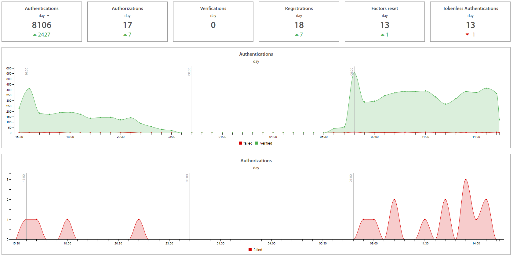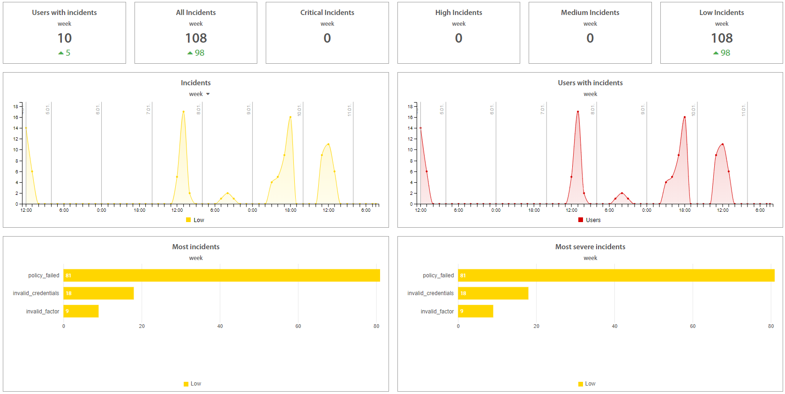

To restart the Server, please click on the “Restart” button.

Facades which are installed on the server are shown on the right side. There is information about the version of Facade, name of server and IP address where facade is installed, usage of RAM and CPU. Green colored status means that Facade is connected, active and works properly. Orange colored status means that Facade is connected, but passive and waits.
Red colored status means that Facade is disconnected and is necessary to launch it. If the active facade is disconnected, the passive facade is switched to active status and works. By hovering with the mouse over the server’s name, the version of server shows up.

To download Facade logs, click on the “Get logs” button of required Facade. Logs will be fetched and then click on the “Download logs” button. Logs are downloaded immediately.

###  5.2. Users

All Active Directory Users who are registered into Excalibur can be found on the Users page. Filtering by groups, accounts, tokens and computers as well as search by name are available in the top right corner.

####  5.2.1. User: Account Detail, Sessions 

Click on the username of selected User in the list of Users and User’s account details page (User page) shows up. User page contains User’s Sessions, Actions, Incidents, Tokens, Computers, Accounts, Policies, Groups, Roles, Subordinates and Locations organized in tabs. In the Sessions tab, all User’s sessions with start and end times are recorded. If the User is still logged, an Administrator can lock or end User’s session - logout the User.

####  5.2.2. User: Actions 

Actions tab displays all actions which the User executed or currently executes, such as: Authentication, Authorization, Verification, Registration and Factor reset, together with an action’s status. Clicking on an individual Action, detailed information shows up. Green colored status means that action has been done successfully. Red means that action failed because one of the required factors of policy was not verified. In the policy table are marked factors which were verified or not. 

####  5.2.3.  User: Incidents

Incidents tab provides a list of all User’s Security Incidents (like Invalid credentials) for a review. Clicking on an individual Incident detailed information shows up.

####  5.2.4. User: Tokens

Tokens tab shows all registered tokens which the User has. A color dot next to the device name represents the token's online / offline state, and below it a mobile app version could be found. By hovering the mouse over the token “Disable” option will show up. After disabling the token, User will not be able to use the selected token.

####  5.2.5. User: Computers

Computers tab contains all computers and PAM resources where the User was or is logged in. If the User is currently connected, status connected is indicated in green. If the User is already logged out, the last time of logout is shown in grey. By clicking on the computer name, the Computer detail page shows up.

####  5.2.6. User: PAM

 

PAM tab contains all PAM resources which are assigned to the user and describes the type of PAM, group where is PAM resource assigned and user groups where is PAM resource assigned. By clicking on an icon or name of a PAM resource, PAM resource details show up. By clicking on button, PAM resource opens.

####  5.2.7. User: Accounts 

Accounts tab represents User’s Active Directory / LDAP account details as Excalibur sees them. 

####  5.2.8. User: Policies 

Policies tab serves to review security policies assigned to the User. With Excalibur, a different set of authentication factors or geofence rules could be set for every Excalibur Action. Administrators can set these rules on the Security policies page.

####  5.2.9. User: Groups & Roles 

Groups tab displays every group the User belongs to. Clicking on a group name will show Groups \> Users page, where groups could be reviewed, edited or created.

Roles tab contains all roles assigned to the User. Roles could be managed on the Security \> Roles page.

####  5.2.10. User: Subordinates 

Subordinates tab contains all User’s subordinates in the company hierarchy. Clicking on the subordinate's username shows his / hers account details page (User page).

####  5.2.11. User: Locations 

 Edit location 

Change date

 Remove location

Locations tab contains the list of all User’s locations from where the User most probably will be logged into PC. User or Administrator may define different locations like Home or Temporary location. Locations may be used to create a Security policy for specific User to allow login only from Company’s Office premises, Home in case of a home office or Temporary location in case of a business trip. For Temporary location date until location will be valid might be specified. Locations can be added by clicking on the “+” button in the top right corner and dragging the circle around the map. If needed to edit or delete location, click on circle by right mouse button or click on selected location in list and select the desired action. For Home location can be changed position only and for Temporary location can be changed expiration date, radius and position. All changes of location have to be authorized with User’s / Administrator’s token by confirming push notification on token or by scanning the QR code.

###  5.3. Timeline 

Timeline page is a summary view of Users’ activity during a given day. Timeline visualizes when every User was logged, locked or disconnected during the day.

Selected date is shown above the timeline and could be changed to previous / next day simply by clicking on the left / right arrow next to it, while the Filter in the top right corner enables a selection of a specific date from a calendar.

Clicking on a username shows the User account detail page.

By hovering and dragging with the mouse over the timeline, detailed information about sessions in specific time shows up.  

###  5.4. Actions 

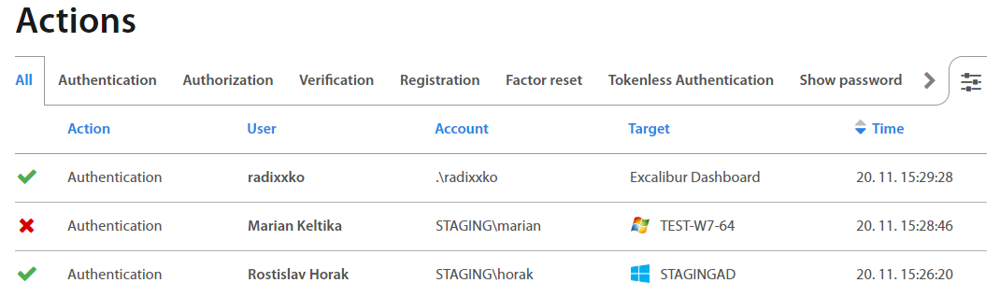

Actions page lists all actions took by every User, such as Authentication, Authorization, Verification, Registration, Factor reset, Tokenless Authentication, Show password and Set geofence. By clicking on an individual Action, detailed information shows up.

####  5.4.1. Registration

At first, User needs to register an account to perform any other action in Excalibur. Registration starts on a Client where User clicks “Register” on the Excalibur login screen and proceeds with self-registration following on-screen instructions. During registration User sets all authentication factors required by the security policy on his/hers Token, which initializes it.

####  5.4.2. Authentication

Authentication or Login is an intent-based action, and the only one in Excalibur which can operate in an online as well as offline mode. User performs his/hers intent by scanning a login QR code from a Client with his/hers Token. The login QR code is dynamically changing - by default Client generates a new one every 15 seconds with 90 seconds validity. Authentication factors are then verified based on the security policy and if it succeeds, in online mode the User is automatically logged into the Client, while in offline mode, on User’s Token is presented an OTP code, which user needs to enter on the Client’s Excalibur login screen to log in.

####  5.4.3. Authorization

Authorization or Action Confirmation is a push notification based action, for example VPN Login (in which a username needs to be entered) will trigger a push notification for a Token of a User specified by the username. On the Token the User is asked to confirm given action with exact specification of what is being confirmed. Authentication factors are then verified based on the security policy and if it succeeds, User’s action is authorized. RADIUS is currently the primary use-case of Authorization.

####  5.4.4. Factors Reset

Registered Users have an option to reset their authentication factors on their Tokens. Firstly, authentication factors are verified based on the security policy and if it succeeds, User proceeds to set new factors.

####  5.4.5. Verification

In case of verification a User with appropriate privileges, e.g. Manager (Verifier) using his/hers Token confirms another User's (Initiator) identity and action. Verification begins either directly by scanning a verification QR code from initiator’s Token, or by receiving a push notification, or via Dashboard. Verification can be configured in the security policy as a required action for any Basic Action or any policy violation. Basic Action’s flow is then modified to accommodate the Verification after the usual authentication factors verification succeeds on the Initiator’s side. If successful, the Verifier is prompted to confirm the action using his/hers authentication factors on his/hers Token. Also, every security policy change requires a verification of the change by the Administrator.

####  5.4.6. Tokenless Authentication 

If a User forgets his/hers Token, or there’s any other reason a User cannot use or doesn’t have his/hers Token at the moment, there’s a backup option to utilize a Tokenless Authentication. In this case, User begins the process on Client’s Excalibur Login screen, selects “Forgotten phone”, inserts his/hers name, PIN and a reason why his/hers Token isn’t available at the moment. If entered name and pin are verified successfully, this request triggers a usual Verification process in which any verifier designated to verify this User based on the security policy, verifies the action either in person or remotely. Based on the user's policy, verifiers have the option to select a time interval on theirs tokens during which the user can login without further verification on a particular computer. For further tokenless login on this computer, User must type username, PIN and give the reason

*For instance*
*Let’s say that User’s tokenless duration is set up to 8 hours. If user clicks on Tokenless button and types username, PIN and reason, verification QR code on CPUI screen will be shown. Verifier scans this QR and provides authentication factors and select duration to one hour on token. Now, User can make further Tokenless logins without verification on this computer. In this time interval, user will type username, PIN and the reason only.*

*In case that login is verified by peers, the duration is set by peer who sets duration as the second in order.*

####  5.4.7. Show Password 

Registered Users have an option to display their password on their registered token. If Show Password is allowed by the company's security policy, then User can display own password. On the Show Password tab, all Show password actions are recorded.

####  5.4.8. Set geofence 

Set geofence’s policy provides options to set rules to set new geofence or location. Each user who uses Excalibur has an option to set its own home or temporary location by token or dashboard. In the Set geofence tab, all changes of geofence and locations are recorded.
 

###  5.5. Sessions

In Sessions, all Logged, Active, and Manual sessions are located, as well as their History. If a session is still active, it’s possible to lock it or end it (log it out). Buttons for these actions show up by hovering the mouse over a session.

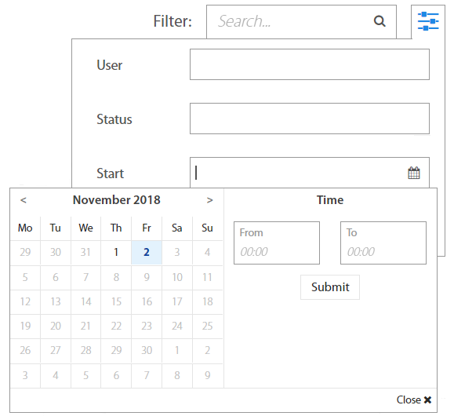

It’s also possible to search in Sessions by username or to filter them by date in the top right corner.

###  5.6. Computers

Computers page consists of all computers with their names, Excalibur version, OS and current status information. It’s possible to search for a computer by its name in the top right corner.

Clicking on the computer name shows detailed information, including all Sessions, Incidents, Users and Groups. The same as on the Sessions page, hovering over the session shows buttons to lock or end a session.

Incidents tab lists all Incidents associated with a chosen computer. By clicking on Incident, detailed information shows up.

Excalibur dashboard provides option for administrators to download logs from any connected computer remotely. If it is necessary to get logs from the computer, find the selected computer, click on computer and click on Get Logs button on the right side. Logs will be packaged and downloaded by clicking on the Download logs button to administrator’s computer.

Note: Computer has to be connected /online/ and supported version of Excalibur client application has to be installed on selected computer to download logs 

###  5.7. Components

Components folder lists all currently deployed Excalibur components and most importantly their versions. By clicking on individual component detailed information about component shows up.

It’s possible to search for a component by its name in the top right corner.

To add a new component, click on the “+” button on the top of the Components list. New window with component settings will open. Creating a new component requires a new component name, platform (WebSDK or RADIUS), component type and service URL.

###  5.8. PAM 

PAM - provides web-based access to Enterprise resources – either directly acting as a HTML5 to other protocols proxy server (RDP, SSH, Telnet, VNC or even Browser access) or via dynamic port-forwarding that enables native clients such as RDP to access resources on the internal network via port forwarding on Excalibur PAM.

Excalibur PAM considers all sessions “privileged” and by default recorded. Every action taken by the user is cryptographically signed to certify it was performed by the authenticated user. The effect of this is that there is continuous matching of every user action (as every user action and user PAM session is recorded and cryptographically signed) to strongly multi-factor authenticated identity. With no way to delegate access or claim it was some other user.

For detailed information about PAM please see Excalibur PAM Manual document.

####  5.8.1. Resources

Resources tab - shows all Applications which are assigned to the user's account. By clicking on the desired icon, the selected connection will be opened in a new tab. It's also possible to add, edit or delete PAM resource.

By clicking on the + button on the top right corner, Administrator can create PAM resources. Fill and select all fields and save application 

Name: Name of application
Type: SSH/RDP/VNC
Hostname: IP or hostname
Port: Range 0 - 65535
Authentication: Type of authentication. Select Private key or Username and password. If Private key is selected, upload private key and fill Passphrase. If Username and password are selected, fill the username and password as Authentication factor.

Special fields
RemoteApp dir (RDP): Directory where application is located
RemoteApp (RDP): Application which will be opened
Encoding (VNC):

####  5.8.2. List

List tab - shows all assigned resources and their type. If user clicks on  button, the connection will be established. By clicking on a specific application, further details will be shown (see section Application Details).

If is needed to edit resource, go with mouse cursor over the row and  button shows up. Click on the  button and create changes. If it is needed to delete a PAM resource, click on the x button. To create new PAM resource, click on the + button

##### List: Sessions 

Sessions tab lists all the past and active user sessions as well as their start / end time. All PAM sessions are by default recorded. By hovering over specified session, the button shows up. Click on to play the session. For SSH connections, it is also possible to download typescript and typescript timing information by clicking on the  or  button. If another user has active PAM connection, administrator may see activity of this user by clicking on  button.

On the right hand are informations about connection of PAM application

It’s also possible to filter Sessions by Account, Computer, Status orStart time in the top right corner.

##### List: Actions & Incidents

Actions tab lists all actions if the PAM resource requires some actions. By clicking on the action, the action details show up.

Incidents tab lists all incidents which occurred during opening the PAM application. By clicking on the incident, the incident details show up.

##### List: Users

Users tab lists all user's details who use the PAM application. By clicking on the user, the user's details show up. By clicking on the token, the token's details show up. By clicking on the account, the account's details show up. If the PAM session is active, then the session column shows the duration of session.

##### List: Groups 

Group tab lists groups where the PAM resource is assigned. By clicking on the group, the group details show up.

##### List: History 

History tab shows all changes of PAM application which were performed

####  5.8.3. File transfers 

Excalibur PAM displays all files which are transferred by users in PAM sessions. Each role has presetted rules to show transferred files. Administrators, Service desks and Auditors see all files which were transferred, managers have access to their own and subordinate’s files. Users have access to their own files only. By clicking on the specific file or  button, file is downloaded immediately. By clicking on the user name or client, further information are shown

####  5.8.4. Fulltext search

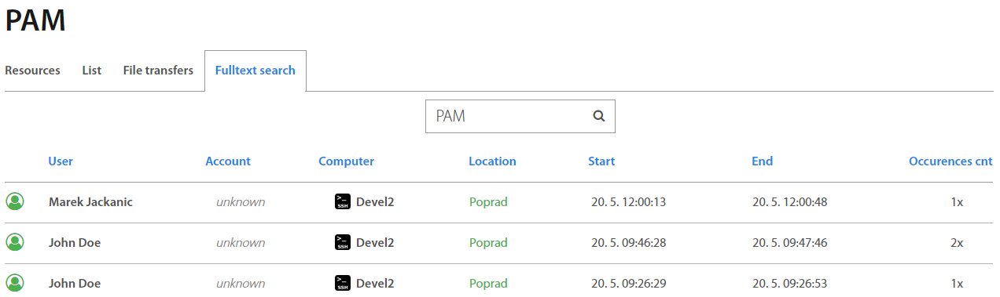

Excalibur PAM allows you to find a full word which is inserted by the user during the PAM session. Each role has presetted rules of searching. Administrators, Service desks and Auditors can search words in all PAM sessions, managers can search in their own and subordinate’s PAM sessions. Users can search in their own sessions only.

###  5.9. SAML Service Providers

SAML Service Provider page allows to upload and manage SAML certificates. Hovering over a specific row, the buttons show up. By clicking on the + button you can upload the SAML file. By clicking on the x button you can delete the SAML file. By clicking on the  button the SAML file is downloaded immediately. On the right side is SAML Configuration. By clicking on the  button the SAML configuration file is downloaded immediately

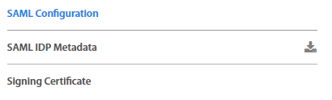

##  6. Groups 

###  6.1. Groups: Users 

This page lists all Groups of Users created in Excalibur. To add a new group, click on
the

 “+” plus button on top of the Groups list. To edit an existing group, click on an individual group name in the list and in the top right corner of the Group details, click on the edit button.

Creating a new group requires a new group name and at least one associated Organizational Unit, Group membership and (optionally) / or just an LDAP Query. To assign / combine multiple of them, use the “OR” button.

Group Detail also includes a view with all Users assigned to the group under the Users tab. Clicking on the username shows the User account detail page.

Policies tab shows Security policies assigned to the group separately for Authentication, Authorization, Verification, Registration and Factor Reset. To add a new policy to the group or to remove an assigned one, just click “+” or “-” button on the top right corner under the Policies tab.

History tab shows changes which were made in the group. It is designed as a list of actions. On the top of the list is the last change which was made.

###  6.2. Groups: Computers

This page lists all computer’s groups created in Excalibur. Clicking on an individual group in the list, group details view shows up. The view consists of Filters and Computers tabs. The first one shows an Organizational Unit the chosen computers group is associated with, while the second one lists all computers this group consists of.

 

To add a new group, click the “+” button on the top of the Groups list, and to edit the chosen one, click edit in the top right corner of the Group detail..

###  6.3. Groups: Geofences 

This page lists all Groups of geofences created in Excalibur. To add a new group, click the “+” button on the top of the Groups list. Under an individual selected group, adding and removing geofences from the group is available.

 {#h.w256l3mj6srh .c24 .c36}

##  7. Security 

###  7.1. Roles 

Roles page lists all roles from the Company's Active Directory. By clicking on an individual role, it’s possible to assign Excalibur Groups to the role, as well as to see all registered users having this role.

###  7.2. Security policies 

On the Security policies page it’s possible to view, edit, add or remove individual policies.

Clicking on a policy shows a view with policies for Authorization, Authentication, Verification, Registration Factor Reset, Show password and Set geofence, which also allows to directly edit them - assign and combine different factors and restrictions for different use-cases for each individual action. 

On the right side there’s also a list of all groups using a given policy, and it’s also possible to add and remove them directly in this list.

For detailed information about Security policies please see Excalibur Security Policies Management document.

###  7.3. Incidents 

Incidents page lists all registered Incidents in Excalibur. By clicking on an individual Incident, detailed information shows up. Factors that failed are shown red so Administrator may find out what was the reason for User's failed action. Administrator can see there also Incident location on the map which may help him with investigation. Besides a list with all incidents, there are also separate tabs that group incidents based on their priority.

####  7.3.1. Incidents Notifications 

Configuration for sending email consists of following steps:

​1. Create SMTP configuration used for sending emails- Chapter [Configurations](#h.aeetnbfb42mc) 
​2. Create notification definition, which includes recipients (group of users) - Chapter [Notification](#h.6zyaqbtqkag9)
​3. Create incident notification where you specify which incidents will trigger appropriate notification - Chapter [Incidents: Notifications](#h.6yxzhrslfei6)

To specify incidents for email notifications click on the + button and define required fields:

Name: Name for Incident notification group

Incidents: Select incidents which will trigger the configured notification

Level: incident severity (Low, Medium, High, Critical)

Notification: Select notification (defined in Notification part) used when incident(s) occurs

To show Incident notification’s detail, click on the specific row and detail shows up on the right side.

###  7.4. Verifications 

Verifications page lists all verifications that happened or are currently happening in Excalibur, as well as categorizes them into tabs based on a type of Action they are associated with.

By clicking on an individual verification, detailed information with GPS location shows up.

###  7.5. Geofences 

Geofences page serves to manage existing and create new geofences in Excalibur.

In the top right corner, there’s a search of geofences based on their names, below it is  a list of all geofences. Selected geofence always appears on the map.

By clicking on “+” plus button, a new geofence can be added to the current (desired) location.

To create a new geofence, click on the desired location on the map and drag a mouse scale the circle. Once the circle covers a desired area, set a geofence name and click the “Create” button. New geofence will appear in the top right corner list of all geofences.

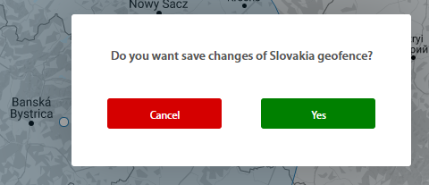

 Edit geofence

Rename geofence

 Remove geofence

It’s also possible to Edit, Rename and Remove existing geofences as needed. Editing means moving a selected geofence around the map by dragging it where it’s desired or scaling it by dragging the circle by its rim. Once done, click outside the geofence circle and confirm changes. All new settings of geofence have to be authorized by token. Administrator authorizes this action by confirming push notification which is received on token or scans QR code with token.

It’s also possible to Edit, Rename and Remove existing geofences by right clicking on the geofence circle and select option.

###  7.6. Audit 

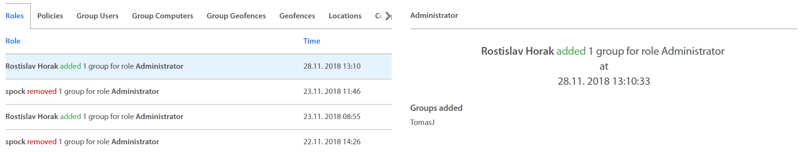

Audit page is a special view available only for Auditor and Administrator roles. It’s designed to provide a glanceable overview of all changes made by Administrators in Roles, Policies and Groups (Users, Computers, Geofences) in chronological order. Because the Auditor's role is designated for audit / review purposes of everything that happened in Excalibur, including changes which only Administrators can make, Auditors can see everything just as Administrators, but cannot change or take any action in the Dashboard.

###  7.7. Notifications

Configuration for sending email consists of following steps:

​1. Create SMTP configuration used for sending emails- Chapter [Configurations](#h.aeetnbfb42mc) 
​2. Create notification definition, which includes recipients (group of users) - Chapter [Notification](#h.6zyaqbtqkag9)
​3. Create incident notification where you specify which incidents will trigger appropriate notification - Chapter [Incidents: Notifications](#h.6yxzhrslfei6)

Notifications allow you to create a connection for sending email
notifications to the User group. To create a connection, click on the +
button and define required fields:

- Name: Name of the connection
- Transfer agent: Select SMTP server created in Configuration part.
- Groups of recipients: Select a User group for which the email notifications will sent - email is read from the AD account of the given user thus doesn’t need to be manually specified

To show Notification’s detail click on the specific row and detail shows up on the right side.

History tab shows a list of email notifications sent.

##  8. Status 

###  8.1. Configuration 

Configuration for sending email consists of following steps:

​1. Create SMTP configuration used for sending emails- Chapter [Configurations](#h.aeetnbfb42mc) 
​2. Create notification definition, which includes recipients (group of users) - Chapter [Notification](#h.6zyaqbtqkag9)
​3. Create incident notification where you specify which incidents will trigger appropriate notification - Chapter [Incidents: Notifications](#h.6yxzhrslfei6)

To configure SMTP server click on the + button and fill the required fields:

Name: Name of the SMTP server,
Hostname: IP or hostname
Port: Range 0-65535
Username and Password: Credentials to authenticate SMTP client to the server
Sender name: Name of sender who sent
Sender mail: Email address from where the mail will sent

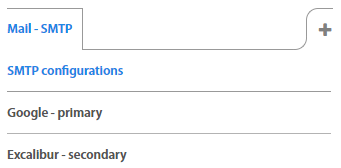

To show detail of the SMTP server, click on the specific server and detail shows up on the right side

###  8.2. Versions 

Versions page lists an Operating System (OS) version, Status and Excalibur version (version of a respective component) of every device in Excalibur ecosystem, as well as a summary of all versions currently used.

Versions are divided into tabs by OS.

###  8.3. Updater

Page from where the update of clients is possible. If a new version of Client is available, you can upload this version by clicking on the + button. Each update must be uploaded as a zip package which includes a new version of client and files with an update script.

On the right side are tabs with information about distribution of
updates and their details.

###  8.4. Logger

Logger is a tool which provides recording of logs which have occured. To add a new Logger type, click on the “+” button, and type the name of the Logger and save it. If it is necessary to delete or rename the logger, click on “x” or button and make the changes or delete it. Logger can be set up for all Levels of logs and Logs are filtered by Value. Logs can be saved and exported in file to selected path.  