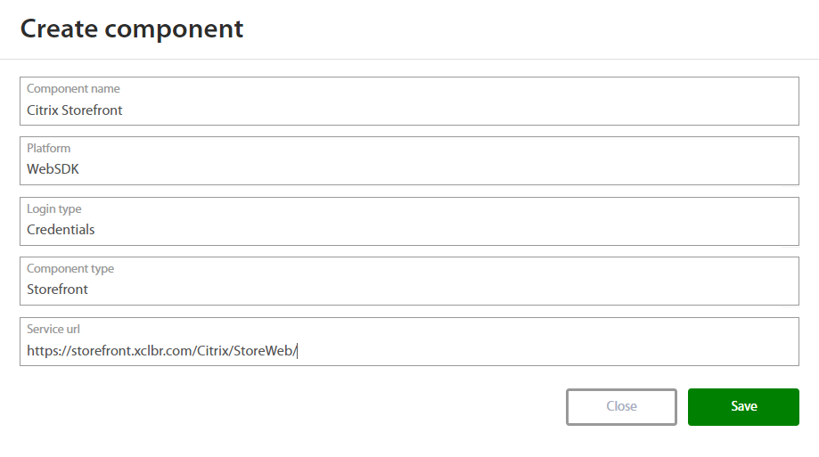

# Excalibur Citrix StoreFront (1912) -  Installation Manual

Version 1.2

## Excalibur Storefront installation 

1.  First create StoreFront component in Excalibur dashboard. Follow steps from chapter: **Add Citrix Storefront component to Excalibur Dashboard**.

2.  After component is created, edit following files on Storefront server:
    1.  custom.script.js (C:\\inetpub\\wwwroot\\Citrix\\StoreWeb\\contrib)
    2.  script.js (C:\\inetpub\\wwwroot\\Citrix\\StoreWeb\\custom) 

Insert following 5 snippets to them:

```
var head = document.getElementsByTagName('head')[0];
```

```
var websdk = document.createElement('script');
```

```
websdk.setAttribute('type','text/javascript');
```

```
websdk.setAttribute('src','https://EXCALIBUR\_SERVER\_URL/websdk/storefront.js');
```

``` 
head.appendChild(websdk);
```

3.  **Change the URL as required (EXCALIBUR\_SERVER\_URL)**. The changes will be immediately in effect after saving of the JavaScript files and reloading StoreFront login page.

### Add Citrix Storefront component to Excalibur Dashboard 

Citrix Storefront component needs to be registered on the Excalibur server. This can be achieved from the Excalibur Dashboard by an Excalibur Administrator. Log into Excalibur Dashboard with an Excalibur Administrator account and select Components from the left menu.

Under Component section click on “+” button on the top right side and create new component with following parameters and save it:

-   Component name: Name of component – such as the name of the Storefront server
-   Platform: WebSDK
-   Login type: Credentials  
-   Component type: Storefront
-   Service url: Address from where the JavaScript is allowed to be loaded, must be exact [https://](https://www.google.com/url?q=https://server_url/Citrix/StoreWeb/&sa=D&ust=1596537828073000&usg=AOvVaw2La2xoOdJ6X0adpgd-UgmZ)[STOREFRONT\_SERVER\_URL](https://www.google.com/url?q=https://server_url/Citrix/StoreWeb/&sa=D&ust=1596537828073000&usg=AOvVaw2La2xoOdJ6X0adpgd-UgmZ)[/Citrix/StoreWeb/](https://www.google.com/url?q=https://server_url/Citrix/StoreWeb/&sa=D&ust=1596537828073000&usg=AOvVaw2La2xoOdJ6X0adpgd-UgmZ) - where StoreWeb is the StoreFront store name



If it is necessary to edit this component, hover over component or click on component in the components list. Click on the edit button, and edit desired fields. Confirm changes by pressing the Save button. If it is necessary to delete this component, click on “x” button and confirm it.
