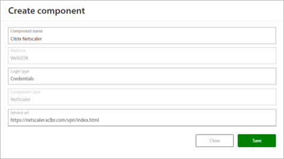
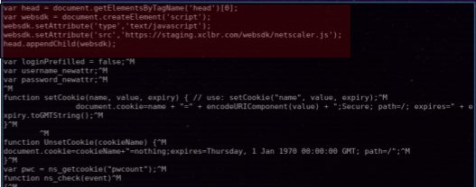
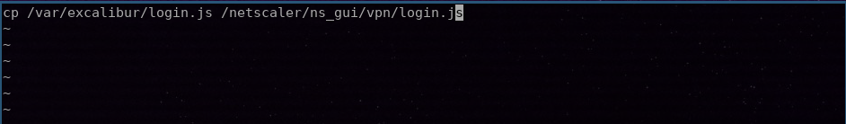

# Excalibur Citrix NetScaler (12.1 - unified gateway) - Installation Manual

Version 1.3

## Excalibur Citrix NetScaler installation
1. First create a NetScaler component in the Excalibur dashboard. Follow steps from chapter: **Add Citrix NetScaler component to Excalibur Dashboard**. 
2. After adding the component follow steps from chapter: **Make changes on NetScaler appliance**. 
3. **Change the URL in the snippet as required (EXCALIBUR_SERVER_URL)**. The changes will be shortly in effect after saving the JavaScript files and reloading NetScaler login page. 

## Add Citrix NetScaler component to Excalibur Dashboard 
Citrix NetScaler component needs to be registered on the Excalibur server. This can be achieved from the Excalibur Dashboard by an Excalibur Administrator. Log into Excalibur Dashboard with an Excalibur Administrator account and select Components from the left menu.  

Under the Component section click on the “+” button on the top right side and create a new component with following parameters and save it.  

- **Component name**: Name of component – such as the name of the NetScaler server  
- **Platform**: WebSDK  
- **Login type**: Credentials  
- **Component type**: NetScaler  
- **Service url**: Address from where the JavaScript is allowed to be loaded, this must correspond to the URL where the login page is located for example:  
[https://NETSCALER_SERVER_URL/vpn/index.html]

<p style="text-align:center;">
</p>  

If it is necessary to edit this component, hover over component or click on component in the components list. Click on the edit  button, and edit desired fields. Confirm changes by pressing the Save button. If it is necessary to delete this component, click on the “x” button and confirm it. 

## Installation on NetScaler appliance
Login to the NetScaler appliance SSH console. Default user login is:  **nsroot** and password: **nsroot**. Launch interactive shell by executing the command:  

```
>shell
```

Use the following command to change working directory to where *login.js* file is located: 

```
# cd /netscaler/ns_gui/vpn/
```

Edit *login.js* file using the vi editor or over SCP (with winSCP for example): 

```
# vi login.js
```

Insert following html snippet as shown on the image below, on top of the script.js file: 

```
var head = document.getElementsByTagName('head')[0];
```

```
var websdk = document.createElement('script');* 
```

```
websdk.setAttribute('type','text/javascript'); 
```

```
websdk.setAttribute('src','https:/EXCALIBUR_SERVER_URL/websdk/netscaler.js'); 
```

```
head.appendChild(websdk); 
```
<p style="text-align:center;">
</p>

This will not persist after reboot! We have to store modifications and add copying of changes on reboot. Create a new directory */var/excalibur*   a copy modified file *login.js* into that directory: 

```
# mkdir /var/excalibur
```

```
# cp /netscaler/ns_gui/vpn/login.js /var/excalibur/login.js
```

Than create and edit new file *rc.netscaler*   within directory */nsconfig*: 

```
# vi /nsconfig/rc.netscaler 
```

Add following snippet to file *rc.netscaler* and **make sure there are no blank lines after this line**: 

```
cp /var/excalibur/login.js /netscaler/ns_gui/vpn/login.js
``` 

<p style="text-align:center;">
</p> 

 Change file mode with following command: 

```
# chmod 777 /nsconfig/rc.netscaler 
```