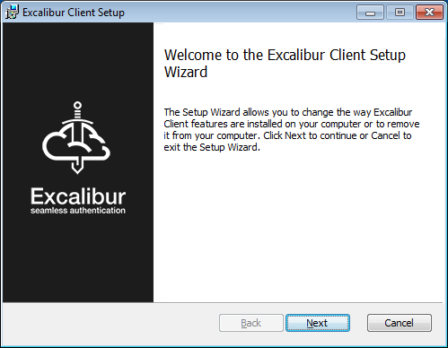
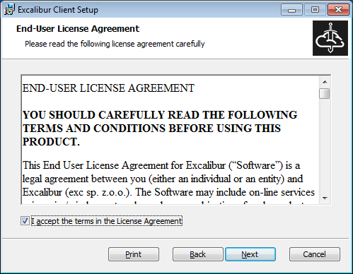
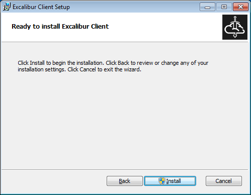
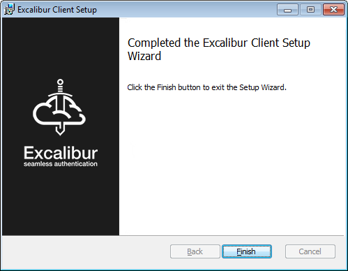
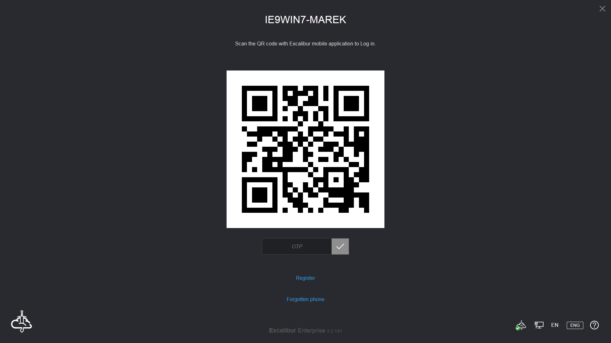
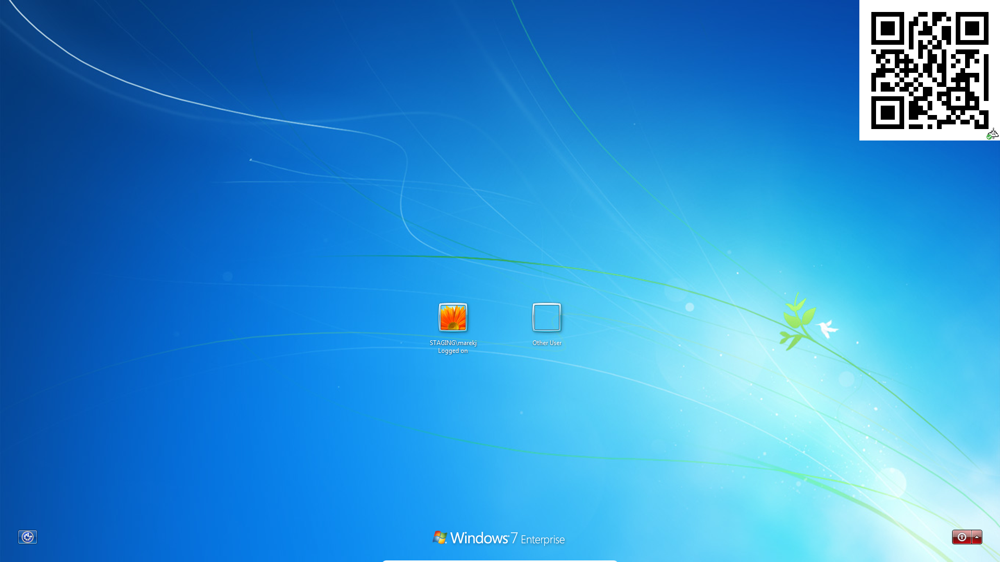
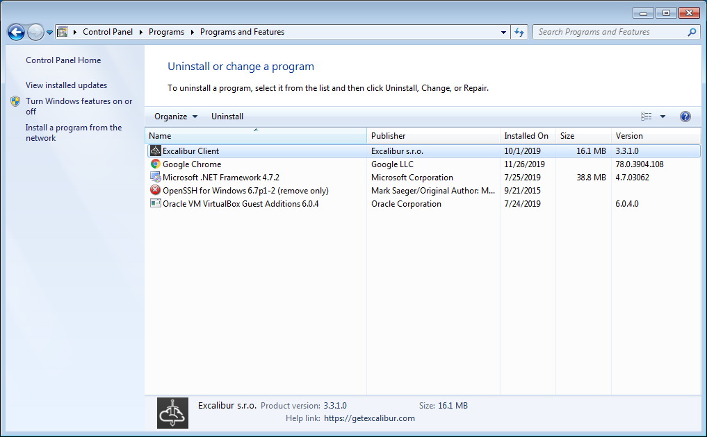

# Excalibur Client Installation Manual
Version 3.3.3

##  1. Table of contents
<!-- vscode-markdown-toc -->
1. [Table of contents](#Tableofcontents)
2. [Introduction](#Introduction)
3. [Excalibur Client Installation](#ExcaliburClientInstallation)
	3.1. [Installation requirements](#Installationrequirements)
	3.2. [Installation steps](#Installationsteps)
4. [How to update Excalibur Client](#HowtoupdateExcaliburClient)
5. [How to uninstall Excalibur Client](#HowtouninstallExcaliburClient)
6. [Further materials](#Furthermaterials)

<!-- vscode-markdown-toc-config
	numbering=true
	autoSave=true
	/vscode-markdown-toc-config -->
<!-- /vscode-markdown-toc -->

##  2. Introduction
Excalibur utilizes the mobile phone to act as a secure hardware token for any and all authentication and authorization needs inside of the enterprise. The ultimate goal is to move all forms of authentication and authorization away from passwords, replace them seamlessly with smartphone-based strong but user friendly multi-factor authentication. Excalibur's unique value is in providing backward compatibility with all the applications, Operating Systems (OS) and services the enterprise uses today thus creating a bridge between the password-based present day and password-free future.
Client - In the context of Excalibur, the client is usually a PC. The client component provides the Excalibur login screen that is displayed on top of the default Operating System login screen / lock screen. This is achieved utilizing the Excalibur Credential Provider

##  3. Excalibur Client Installation
###  3.1. Installation requirements
- OS: Windows 7 with Service Pack 1 (SP1) or higher
- RAM: min 1GB for 32bit version, 2GB for 64bit version
- HDD: 20MB disk space + log files (depends on usage & debug level)
- Internet Explorer 9 or higher installed
###  3.2. Installation steps
Installation packages are released in 32 and 64 bit versions. Both versions are available in the Excalibur CRM System. Download the required installation package, launch it and follow the steps. If needed, provide elevated credentials when the system asks you.

Click on the Next button

Accept terms and click on the Next button

Click on the Install button

When installation was successful click on the Finish button and you will be redirected to Excalibur YouTube channel.
Now, Excalibur is prepared for use. Lock or Log Out the computer, the Excalibur CPUI should be shown. Excalibur CPUI can be shown in fullscreen mode or minimal mode. To minimize CPUI, click on “X” button. In some cases is necessary to hold the click on “X” button to minimize it. y clicking on the QR code in minimal mode, the CPUI is maximized. If the Excalibur CPUI is not shown, reboot your system. If the problem persists, contact support and report a problem.

##  4. How to update Excalibur Client
When a new version of Excalibur Client is available, it is recommended to upgrade the old version to the new version. Upgrading may solve issues /if were found/, ability, speed, etc. Before installation is not necessary to stop the Excalibur Client process or uninstall Excalibur Client. Just reinstall Excalibur Client.

##  5. How to uninstall Excalibur Client
To uninstall Excalibur client there is no special step. Go to Apps / Programs in your system and uninstall client

##  6. Further materials
[Excalibur User Manual EN v1.10](../xclbr-user-manual/README.md)