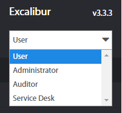
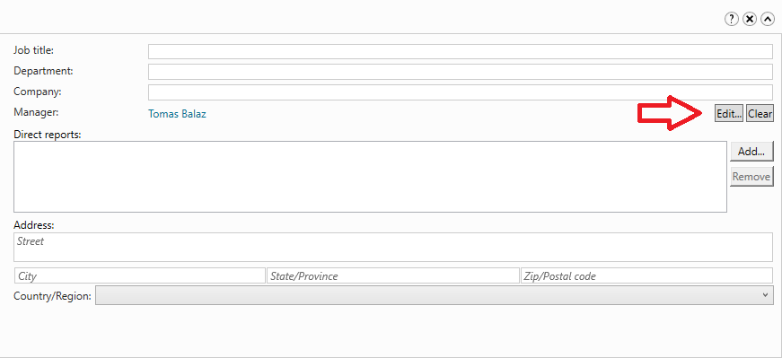
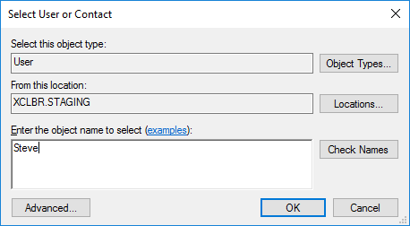
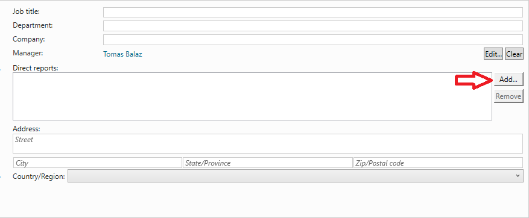
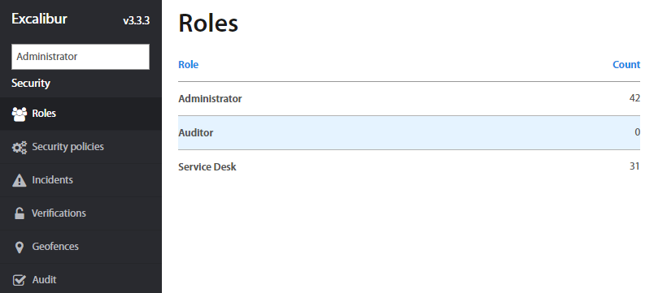
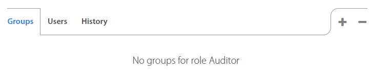
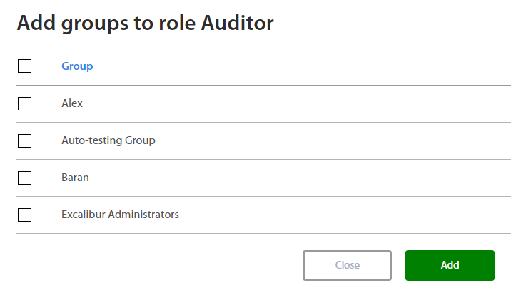

# Excalibur Enterprise Roles Description

Version 1.4

## Table of contents
<!-- vscode-markdown-toc -->
1. [Introduction](#introduction)
2. [How to assign a Manager role in Active Directory](#assign-a-manager-role)
3. [How to assign role in Excalibur Dashboard](#assign-role-dashboard)
4. [Roles description](#roles-description)
    4.1. [User](#user)
        4.1.1. [Section Summary](#section-summary)
        4.1.2. [Overview](#overview)
    4.2. [Manager](#manager)
        4.2.1. [Sections summary](#section-summary-1)
        4.2.2. [Overview](#overview-1)
        4.2.3. [Security](#security-1)
        4.2.4. [Status](#status-1)
    4.3. [Administrator](#administrator)
        4.3.1. [Sections summary](#section-summary-2)
        4.3.2. [Overview](#overview-2)
        4.3.3. [Groups](#groups-2)
        4.3.4. [Security](#security-2)
        4.3.5. [Status](#status-2)
    4.4. [Auditor](#auditor)
        4.4.1. [Sections summary](#section-summary-3)
        4.4.2. [Overview](#overview-3)
        4.4.3. [Groups](#groups-3)
        4.4.4. [Security](#security-3)
        4.4.5. [Status](#status-3)
    4.5. [Service desk](#service-desk)
        4.5.1. [Sections summary](#section-summary-4)
        4.5.2. [Overview](#overview-4)
        4.5.3. [Groups](#groups-4)
        4.5.4. [Security](#security-4)
        4.5.5. [Status](#status-4)
    4.6. [Peer](#peer)

<!-- vscode-markdown-toc-config
	numbering=true
	autoSave=true
	/vscode-markdown-toc-config -->
<!-- /vscode-markdown-toc -->
## Introduction

This document describes roles in Excalibur Enterprise and relations between them. User and Manager roles are set up by Active Directory and Administrator, Auditor and Service Desk are set up by Excalibur Dashboard.

Despite multiple User roles a User might have, everyone is logged into the Dashboard under the User role by default. Regular User only sees his / hers own Actions and Sessions. A deployed Excalibur instance always has at least one User with the Administrator role assigned.

In Dashboard User Interface (UI) in the top left corner, there is a drop-down menu to choose among different User Roles assigned to the User. Each Role implies its own range of capabilities available in the Dashboard.

Roles in Excalibur are created in two ways. The first is setting from Active Directory (AD) where the user is defined with his/her level on the company's hierarchy. By default, each account created in the Active Directory has a user role in the Excalibur. Manager role and relation between peers are defined too. Second way is to assign the roles for users in the Excalibur dashboard such as Administrator, Service desk and Auditor.

# How to assign a Manager role in Active Directory

1.  Login to your AD server
2.  Open Server Manager and select Tools \> Active Directory Administrative Center
3.  Select user from the list and open user details
4.  Add a manager role by selecting other user account
 

1.  If you want to assign a manager for this user, click on the Edit button on Organization tab part Manager. Fill the name of the manager and confirm it.

If users have the same manager, then users are peers.

2.  If you want to assign subordinates to manager, click on the Add button next to Direct reports and fill name of subordinates and save it

## How to assign role in Excalibur Dashboard

Only Excalibur Administrator can assign the role in Excalibur Dashboard. The procedure how to assign the role for user is following:

1.  Firstly, User have to be assigned to the User group. Procedure how     to assign a user to group is described in Administrator Dashboard Manual
2.  Go to Security section and click on Roles
3.  Select role which you want assign for User group
4.  By clicking on + or - button on the right side you can add or remove user groups from / to list.
5.  Select the group from the list and confirm by the Add or Remove button.
6.  If you want to remove a group from the role, confirm this action.

# Roles description

## User 

By default, each account which is created in Active Directory has a user role. User is a person, an end-user who uses Excalibur to Authenticate and Authorize against Company’s Client(s) and integrations, utilizing his/hers personal Token, and if available on a given Client, manage his/hers sessions. User might also Verify his/hers colleagues (if allowed and required), Reset his/hers own authentication factors, as well as expired password on a Client (if applicable). Every user can also log into the Dashboard, where a regular User only sees his/hers own Actions and Sessions. Detailed description for User Dashboard interface is in Excalibur User’s Dashboard Manual document.

### Section Summary

#### Overview

* Own Overview- Contains user’s Sessions, Actions, Incidents, Tokens, Computers, Accounts, Policies, Groups, Roles and Subordinates organized in tabs.\
* Actions- List of all Actions took by a user, such as Authentication, Authorization, Verification, Registration, Factor reset and Tokenless Authentication.\
* Sessions- List of all Logged, Active, and Manual sessions, as well as their History.
* PAM - List of PAM resources which are assigned to user

## Manager

Manager is a person who uses Excalibur to Authenticate and Authorize against Company’s Client(s) and integrations, utilizing his/hers personal Token, and if available on a given Client, manage his/hers sessions. Manager might also Verify his/hers colleagues or subordinates (if allowed and required), Reset his/hers own authentication factors, as well as expired password on a Client (if applicable). Every manager can also log into the Dashboard, where a regular Manager can see his/hers own Actions and Sessions. Manager can see and manage settings of his/her subordinates who are managed by him/her. Manager role is set up in the Active Directory by adding subordinates to User account.

### <a name="section-summary-1">Sections summary</a>

#### <a name="overview-1">Overview</a>

* Overview - Page with statistics tabs which provide information about Actions, Devices, Sessions and incidents. They can be shown by date interval.
* Users- List of all subordinates who are assigned to manager.
* Timeline- Summary view of subordinates activity during a given day.
* Actions- List of all actions took by subordinates.
* Sessions- List of all managers and subordinates logged, active, and manual sessions, as well as their history.
* Computers- List of all computers at manager group, with their names, Excalibur version, OS and current status information.
* PAM- List of PAM resources which are assigned to user

#### <a name="security-1">Security</a>

* Incidents- Lists of all registered incidents by manager group in Excalibur.
* Verifications- List of all verifications that happened or are currently happening at manager group in Excalibur.

#### <a name="status-1">Status</a>

* Versions- List of all Operating System (OS) versions, Statuses and Excalibur versions (version of a respective component) of every device in manager group, as well as a summary of all versions currently used. \
* Errors- Lists of all errors that happened in the manager group under every component.

## Administrator

Administrator is a person in the company who has access to all settings at Excalibur Dashboard and who is responsible for the administration of Excalibur system. Administrator can manage all settings in the Excalibur Dashboard. Detailed description for Administrator Dashboard interface is in Excalibur Administrator’s Dashboard Manual document

### <a name="section-summary-2">Sections summary</a>

#### <a name="overview-2">Overview</a>

* Overview - Page with statistics, which provides information about Actions, Devices, Sessions and incidents. They can be shown by date interval. There is a tab with server information too. Server can be rebooted from this place and show Logs from Active Directory Facade .
* Users- List of all Active Directory users with their registered Tokens.
* Timeline- Summary view of users activity during a given day.
* Actions- List of all actions took by every user.
* Sessions- List of all logged, active, and manual sessions, as well as their history.
* Computers- List of all computers with their names, Excalibur version, OS and current status information.\
* Components- Lists of all currently deployed Excalibur components and their versions.
* PAM - List of PAM resources which are assigned to user

#### <a name="groups-2">Groups</a>

* Users- List of all groups of users created in Excalibur.
* Computers- List of all computers groups created in Excalibur.
* Geofences- List of all groups of geofences created in Excalibur.

#### <a name="security-2">Security</a>

* Roles- List of all roles from the company's Active Directory.\
* Security policies- Page to view, edit, add or remove individual policies.\
* Incidents- Lists of all registered incidents in Excalibur.\
* Verifications- List of all verifications that happened or are currently happening in Excalibur.\
* Geofences- Page which serves to manage existing and create new geofences in Excalibur.
* Audit - Page which provides information about changes in a list.

#### <a name="status-2">Status</a>

* Versions- List of all Operating System (OS) versions, Statuses and Excalibur versions (version of a respective component) of every device in Excalibur ecosystem, as well as a summary of all versions currently used.
* Errors- Lists of all errors that happened in Excalibur under every component.

## Auditor

Some companies can require a role for a person who will control the settings of Excalibur. For this case is the Auditor role in Excalibur. This person has access to Excalibur Dashboard like as Administrator but the Auditor can't execute changes of settings.

### <a name="section-summary-3">Sections summary</a>

#### <a name="overview-3">Overview</a>

* Overview - Page with statistics tabs which provide information about Actions, Devices, Sessions and incidents. They can be shown by date interval. There is a table with server information and Facade logs too.
* Users- List of all Active Directory users with their registered Tokens..
* Timeline- Summary view of users activity during a given day.
* Actions- List of all actions took by every user.
* Sessions- List of all logged, active, and manual sessions, as well astheir history.
* Computers- List of all computers with their names, Excalibur version, OS and current status information.
* Components- Lists of all currently deployed Excalibur components and their versions.
* PAM- List of PAM resources which are assigned to user

#### <a name="groups-3">Groups</a>

* Users- List of all groups of users created in Excalibur.
* Computers- List of all computers groups created in Excalibur.
* Geofences- List of all groups of geofences created in Excalibur.

#### <a name="security-3">Security</a>

* Roles- List of all roles from the company's Active Directory.
* Security policies- Page to view, edit, add or remove individual policies.
* Incidents- Lists of all registered incidents in Excalibur.
* Verifications- List of all verifications that happened or are currently happening in Excalibur.
* Geofences- Page which serves to manage existing and create new geofences in Excalibur.
* Audit - Page which provides information about changes in a list.

#### <a name="status-3">Status</a>

* Versions- List of all Operating System (OS) versions, Statuses and Excalibur versions (version of a respective component) of every device in Excalibur ecosystem, as well as a summary of all versions currently used. 
* Errors- Lists of all errors that happened in Excalibur under every component.

## Service desk

Service desk has same access to Excalibur dashboard like Administrator, but Service desk has restricted access to edit data in account and fields such as Policies, Groups, Location etc. 

### <a name="section-summary-4">Sections summary</a>
#### <a name="overview-4">Overview</a>

* Overview - Page with statistics tabs which provide information about Actions, Devices, Sessions and incidents. They can be shown by date interval. There is a table with server information too. Server can be restarted from this place and show Logs from Active Directory Facade .
* Users- List of all Active Directory users with Excalibur app installed and registered into Excalibur.
* Timeline- Summary view of users activity during a given day.
* Actions- List of all actions took by every user.
* Sessions- List of all logged, active, and manual sessions, as well as their history.
* Computers- List of all computers with their names, Excalibur version, OS and current status information.
* Components- Lists of all currently deployed Excalibur components and their versions.
* PAM- List of PAM resources which are assigned to user

#### <a name="groups-4">Groups</a>

* Users- List of all groups of users created in Excalibur.
* Computers- List of all computers groups created in Excalibur.
* Geofences- List of all groups of geofences created in Excalibur.

#### <a name="security-4">Security</a>

* Roles- List of all roles from the company's Active Directory.
* Security policies- Page to view, edit, add or remove individualpolicies.
* Incidents- Lists of all registered incidents in Excalibur.
* Verifications- List of all verifications that happened or are currently happening in Excalibur.
* Geofences- Page which serves to manage existing and create new geofences in Excalibur.
* Audit - Page which provides information about changes in a list.

#### <a name="status-4">Status</a>

* Versions- List of all Operating System (OS) versions, Statuses and Excalibur versions (version of a respective component) of every device in Excalibur ecosystem, as well as a summary of all versions currently used. 
* Errors- Lists of all errors that happened in Excalibur under everycomponent.

## Peer

Peer is a special term which is used in policy for verification of users. Peer is not a real role, but it means that user’s accounts created in Active Directory are on the same hierarchy and have the same manager. Users without the same assigned manager are not peers.

