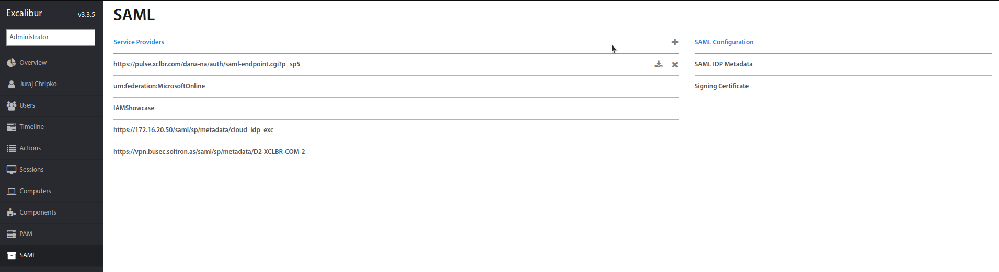
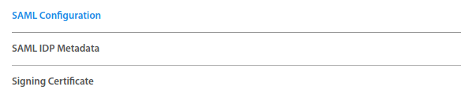
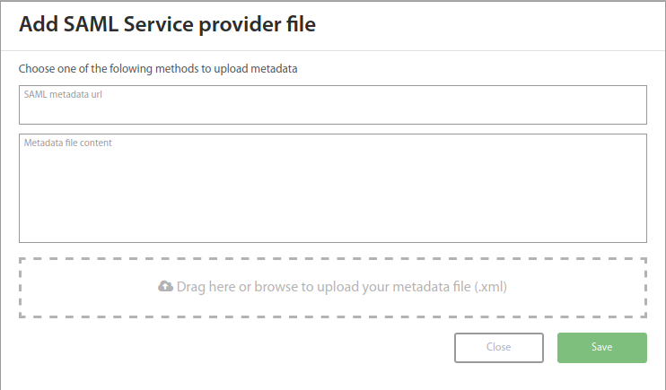
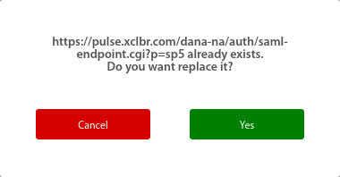
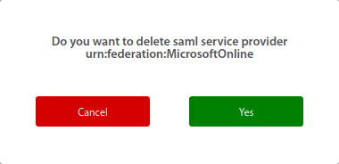

# Excalibur SAML Integration
Excalibur SAML Integration manual

To manage SAML you need to be logged into Excalibur Dashboard as Administrator.
Excalibur Dashboard SAML user interface:



### Get Excalibur IDP Metadata
- Download metadata file:
    
    You can download Excalibur SAML IDP metadata by clicking on `SAML IDP Metadata`:
    
    
    
- Show metadata in browser:
 
    Go to `https://xclbr.com/saml/metadata`, where `xclbr.com` is Excalibur server domain name
    
    Example:

    ```
    <EntityDescriptor entityID="xclbr.com">
    <IDPSSODescriptor WantAuthnRequestsSigned="false" protocolSupportEnumeration="urn:oasis:names:tc:SAML:2.0:protocol">
    <KeyDescriptor use="signing">
    <ds:KeyInfo>
    <ds:X509Data>
    <ds:X509Certificate>
    MIIFWzCCA0OgAwIBAgIUBxMfRNk3gvc1AAEFHQ1d8beC2+gwDQYJKoZIhvcNAQELBQAwPTELMAkGA1UEBhMCQVUxCzAJBgNVBAgMAlNLMSEwHwYDVQQKDBhJbnRlcm5ldCBXaWRnaXRzIFB0eSBMdGQwHhcNMjAwNzA4MTAwNzExWhcNMzAwNzA2MTAwNzExWjA9MQswCQYDVQQGEwJBVTELMAkGA1UECAwCU0sxITAfBgNVBAoMGEludGVybmV0IFdpZGdpdHMgUHR5IEx0ZDCCAiIwDQYJKoZIhvcNAQEBBQADggIPADCCAgoCggIBALTRhAnTQ1Kc4BSIt2KyEwUXaYV4mUtJqBf6xQOIz6DNV1onZKrMfJIx/1geNK+DaNc3qu/KRi9JShzX9W9aD7bTqb0o6kgr8H9vFjgca4oW5Q35P2m8Af1AeSHCLpx7jzIovyyazkQdNOOBpZBl+n0qarQtN65J5EdKd9/t6WU/OTcu5IMM9ekdhSh1srEoxBdXRFY+VI38Yn/z2ZIRFKuVEAyGYdQGx6jUvzwqevUa6L+KoQ7MMdQbDl6c24iIwdhPWs58xibk42AUrUNhzncU6R6kVlDTpz4nNTpGSPKqLuGZXmufgI7YjSRJ+h1uYMeIE8xqym2s7VUGO5wDg6nHcG/IWiKjRzYMJkIgV3qZZnd4XPWatgckHK8T4ikW/URFGlFAoAutvP9tC5pzbHeShEW1WLHmla4I+7j9rLVDTO7FeH93pLYrzu8XvqmwhpsOoiMC2l9uQ96gdKqwLMo1byZt5zWdvx5iOi5wGXOIdBwRf5V66CE+cjMurVgRhc+s1HoiYAaehadsRNzr3EU8q/T5JRInimDYVadXZ9cxSlfQtC/94l5lGbTwa18lELt2YZKCjktXYw2rE7d6RtZ097EbuRs9fne6KBp9l61vJP05y8wCokRgB35tlnBrh8rsLNqHjgLrukfUyOq/26oPhojEthjBmXzdnfJCVBJDAgMBAAGjUzBRMB0GA1UdDgQWBBTDaLh/T/fF2Y9ts9oQRwpP9crMkDAfBgNVHSMEGDAWgBTDaLh/T/fF2Y9ts9oQRwpP9crMkDAPBgNVHRMBAf8EBTADAQH/MA0GCSqGSIb3DQEBCwUAA4ICAQAtnEffqsJyYJ3oLFH5JIFFRkBNIFW3loEJR64bcU7NEBJi4kpwJYS7w/ANHMJhv46pAE1gfdGL4CrxiFQfvregVvXF0b74aI/Dr5OD2lnpmS1q/odp2QOz1HI7kyfj/q/DruBa9/WfvStD4aUmI+pYKAWVeBGSiGJQnUi9ePNMAT9XoSb59262ZSWNPWF52o32MwouKZpz0fYtof1iYQJau4/yYGdGJnaDKLZKilOBvgD4uVfeNyF/YZFag4H+xcdD26bStkFNZ8kAaI/5cp4YKnZiSDadcr/fxNlp+PK9U21NihcHFkguce67EtAlN8KSz/d9V/8LhoUT3QcN6x6uWXxjTb9KUAZoEhMBr32HlLYI8MDMxhe7r/SbE+MgeZ+/cl+bhrBWoA51wrCXKXlnI3qYzxOf97QoqlA3JwVZQ8qtQjOSHXn6PYPbjP+AUKJ+284w+B/2bN8akpY4kR1/VQEl58+bSe+2IGqmKfASKHD69G/BcjZy2zv5HI3y3o61bY2exMN926xIFhqIEQnbsirsOyMpZ+8fSAQ/euWEbJ09AwJxrS/rGqNbP4azwCY+XOKqXTxjKEk6MwsgewQD7AUT4GiUM0DqjnaP+Qyl7XzjCdRK1/L/NLUcgtgOK0yKiVvpEqXP3huDfZg5rgWP8cgf9GJhwBnJlAJ4KdyUoQ==
    </ds:X509Certificate>
    </ds:X509Data>
    </ds:KeyInfo>
    </KeyDescriptor>
    <NameIDFormat>
    urn:oasis:names:tc:SAML:2.0:nameid-format:persistent
    </NameIDFormat>
    <NameIDFormat>
    urn:oasis:names:tc:SAML:1.1:nameid-format:emailAddress
    </NameIDFormat>
    <NameIDFormat>
    urn:oasis:names:tc:SAML:2.0:nameid-format:transient
    </NameIDFormat>
    <SingleSignOnService Binding="urn:oasis:names:tc:SAML:2.0:bindings:HTTP-Redirect" Location="https://xclbr.com/saml/login"/>
    <SingleSignOnService Binding="urn:oasis:names:tc:SAML:2.0:bindings:HTTP-POST" Location="https://xclbr.com/saml/login-post"/>
    <SingleLogoutService Binding="urn:oasis:names:tc:SAML:2.0:bindings:HTTP-Redirect" Location="https://xclbr.com/saml/logout"/>
    </IDPSSODescriptor>
    </EntityDescriptor>
    ```

### Get Excalibur IDP Certificates
 - Download Signing Certificate:
    Used for signing SAML messages / assertions if Service Provider is configured that way.
    
    
    
 - Download Encryption Certificate:
 If Excalibur IDP is configured to encrypt messages/assertion encryption certificate should be located in 
 Excalibur Dashboard in the same place as [signing certificate](#get-excalibur-idp-certificates).
    
### Managing Service providers (SPs)
#### Add Service provider (SP)
Service providers are managed using SAML SP Metadata.



#### Edit Service provider (SP)
Editing is done the same way as adding new Service provider but with edited metadata.
When editing SP confirmation dialog will be displayed:



#### Remove Service Provider (SP)
Just click the cross button next to SP you want to delete.
You will be prompted to confirm your action:




## Configurations
### Fortigate configuration
Resources:  

- [Fortigate as SP](https://docs.fortinet.com/document/fortigate/6.2.3/cookbook/563096/configuring-a-downstream-fortigate-as-an-sp)
- [SSL VPN (6.2.3)](https://docs.fortinet.com/document/fortigate/6.2.3/cookbook/559546/ssl-vpn-full-tunnel-for-remote-user)
- [SAML SSO with AZURE as IDP (6.2.0)](https://docs.fortinet.com/document/fortigate/6.2.0/azure-cookbook/584456/configuring-saml-sso-login-for-ssl-vpn-web-mode-with-azure-ad-acting-as-saml-idp)
- [SAML SSO with AZURE as IDP](https://kb.fortinet.com/kb/php/search.do?cmd=displayKC&docType=kc&externalId=FD45699&sliceId=1&docTypeID=DT_KCARTICLE_1_1&dialogID=124732442&stateId=1%200%20124730913%27)

#### Example configurations
For SSL VPN:
```
config user saml
    edit "XCLBR-SAML"
        set cert "Fortinet_Factory"
        set entity-id "https://10.67.56.24/remote/saml/metadata"
        set single-sign-on-url "https://10.67.56.24/remote/saml/login"
        set single-logout-url "https://10.67.56.24/remote/saml/logout"
        set idp-entity-id "https://staging.xclbr.com"
        set idp-single-sign-on-url "https://staging.xclbr.com/saml/login"
        set idp-single-logout-url "https://staging.xclbr.com/saml/logout"
        set idp-cert "REMOTE_Cert_1"
    next
end

config user group
    edit "SAML-SSLVPN"
        set member "XCLBR-SAML"
    next
end

config firewall policy
    edit 8
        set name "SSLVPN"
        set srcintf "ssl.root"
        set dstintf "any"
        set srcaddr "all"
        set dstaddr "all"
        set action accept
        set schedule "always"
        set service "ALL"
        set logtraffic all
        set groups "SAML-SSLVPN"
    next
end
```
Just for Admin login:
```
config system saml
    set status enable
    set role service-provider
    set default-login-page normal
    set default-profile "super_admin"
    set cert ''
    set idp-entity-id "https://excaliburmfa.intertech.com.tr"
    set idp-single-sign-on-url "https://excaliburmfa.intertech.com.tr/saml/login"
    set idp-single-logout-url "https://excaliburmfa.intertech.com.tr/saml/logout"
    set idp-cert "REMOTE_Cert_2"
    set server-address "10.140.140.76"
end
```

---

### Pulse configuration
#### Configuring SAML
- create new Metadata Provider in System -> Configuration -> SAML -> New Metadata Provider
- create new Authentication Server in Authentication -> Auth. Servers -> New Server
- change auth. server in User Realms -> your user group -> Authentication drop down
 
#### Metadata
Service Provider Metadata can be downloaded from Auth Servers -> SAML Server -> Settings -> Download Metadata 

---

### Cisco ASA Configuration
Resources:  

- [Cisco ASA Series VPN CLI Configuration Guide](https://www.cisco.com/c/en/us/td/docs/security/asa/asa97/configuration/vpn/asa-97-vpn-config/webvpn-configure-users.html)
- [Configure Clientless SSL VPN (WebVPN) on the ASA](https://www.cisco.com/c/en/us/support/docs/security-vpn/webvpn-ssl-vpn/119417-config-asa-00.html)
- [Cisco ASA VPN SAML-authentication - some tips and tricks](https://www.wiresandwi.fi/blog/asa-vpn-saml-authentication-some-tips-and-tricks)
 
 **Configuration steps with example values**:  

 1. ##### Set time synchronization between the IdP and the ASA(SP):  

    ```
    ciscoasa(config)# ntp server 209.244.0.4
    ```

 1. ##### Import the IdP's signing certificate into a trustpoint:
    - [How to get Excalibur Signing certificate](#get-excalibur-idp-certificates)

    ```
    ciscoasa(config)# crypto ca trustpoint exc-tp
    ciscoasa(config-ca-trustpoint)# enrollment terminal
    ciscoasa(config-ca-trustpoint)# no ca-check
    ciscoasa(config-ca-trustpoint)# crypto ca authenticate exc-tp
    Enter the base 64 encoded CA certificate.
    End with the word "quit" on a line by itself
    quit
    INFO: Certificate has the following attributes:
    Fingerprint:     85de3781 07388f5b d92d9d14 1e22a549
    Do you accept this certificate? [yes/no]: yes
    Trustpoint CA certificate accepted.
    % Certificate successfully imported
    ```
    
 1. ##### Add a SAML IdP: 
    
    ```
    ciscoasa(config-webvpn)# saml idp xclbr
    ```
    
    where `xclbr` is `entityID` of Excalibur IDP from metadata.
    
 1. ##### Configure attributes under saml-idp sub-mode: 
    - [How to get Excalibur IDP Metadata](#get-excalibur-idp-certificates)
    
    ```
    ciscoasa(config-webvpn-saml-idp)# url sign-in https://xclbr.com/saml/login
    ciscoasa(config-webvpn-saml-idp)# url sign-out https://xclbr.com/saml/logout
    ciscoasa(config-webvpn-saml-idp)# trustpoint idp exc-tp
    ciscoasa(config-webvpn-saml-idp)# trustpoint sp asa_saml_sp
    ciscoasa(config-webvpn-saml-idp)# base-url https://vpn.asa.com      
    ciscoasa(config-webvpn-saml-idp)# signature rsa-sha256
    ciscoasa(config-webvpn-saml-idp)# timeout assertion 7200
    ``` 
    where:  

    - `xclbr.com` is Excalibur server domain name (FQDN)
    - `exp-tp` is truspoint with imported Excalibur signing cert from [step 2](#import-the-idps-signing-certificate-into-a-trustpoint).
    - `asa_saml_sp` is ASA trustpoint with certificates imported
    - `vpn.asa.com` is ASA domain name (FQDN)
    
 1. ##### Configure an IdP for a tunnel group and enable SAML authentication:

    ```
    ciscoasa(config)# webvpn
    ciscoasa(config-webvpn)# tunnel-group-list enable
    ciscoasa(config)# tunnel-group idp_exc type remote-access
    ciscoasa(config)# tunnel-group idp_exc webvpn-attributes
    ciscoasa(config-tunnel-webvpn)# authentication saml
    ciscoasa(config-tunnel-webvpn)# group-alias Excalibur enable
    ciscoasa(config-tunnel-webvpn)# saml identity-provider xclbr.com
    ```

    where `xclbr` is saml idp name from [step 4](#add-a-saml-idp).
    
 1. ##### Add Cisco ASA SP Metadata to Excalibur IDP:
    1. You can get the ASA's SAML SP metadata from ` https://vpn.asa.com/saml/sp/metadata/idp_exc`, where:  
        - `vpn.asa.com` is ASA domain name (FQDN)
        - `idp_exc` is `tunnel-group` configured in [step 6](#configure-an-idp-for-a-tunnel-group-and-enable-saml-authentication)
    1. [Adding SP metadata to Excalibur IDP](#add-service-provider-sp)


!!! note "Notes"
    - Certificate CN does **not** have to be the same as `entityID` of IDP
    - SAML idp name needs to be same as `entityID` of IDP
    - Running Cisco ASA in esx could lead to incorrect system time, check with `show clock`, restart should resolve this issue (don`t forget to write configuration)
    - SAML responses have limited time validity
    - Self signed *signing* certificate should be enough for SAML

--- 

### RSA SAML Test Service Provider configuration
https://sptest.iamshowcase.com/  

1. Go to `https://sptest.iamshowcase.com/instructions` and download SP metadata
1. [Add SP metadata to Excalibur IDP](#add-service-provider-sp)
1. [Download IDP metadata](#get-excalibur-idp-metadata)
1. Upload IDP metadata to `https://sptest.iamshowcase.com/instructions`
1. Try login using Excalibur from generated url
