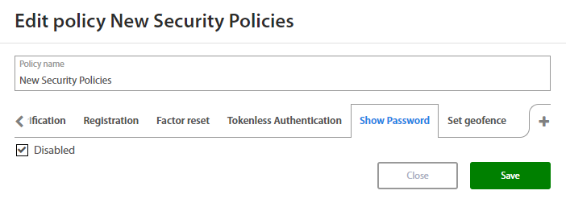
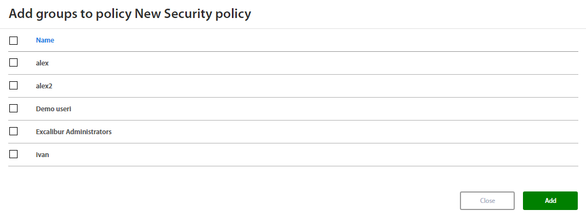

# Excalibur Security Policies Management

Version 1.2.10
## Table of contents
<!-- vscode-markdown-toc -->
1. [Policies and Factors](#PoliciesandFactors)
2. [Security Policies Management](#SecurityPoliciesManagement)
3. [Sections Summary](#SectionsSummary)
	3.1. [Removing existing Security policy](#RemovingexistingSecuritypolicy)
	3.2. [Adding new Security policy](#AddingnewSecuritypolicy)
		3.2.1. [Authentication](#Authentication)
		3.2.2. [Authorization](#Authorization)
		3.2.3. [Verification](#Verification)
		3.2.4. [Registration](#Registration)
		3.2.5. [Factor Reset](#FactorReset)
		3.2.6. [Tokenless Authentication](#TokenlessAuthentication)
		3.2.7. [Show Password](#ShowPassword)
		3.2.8. [Set geofence](#Setgeofence)
	3.3. [How to create copy of policy](#Howtocreatecopyofpolicy)
	3.4. [How to edit Security policy](#HowtoeditSecuritypolicy)
		3.4.1. [How to add a new set of rules](#Howtoaddanewsetofrules)
		3.4.2. [How to delete set of rules](#Howtodeletesetofrules)
		3.4.3. [How to disable set of rules](#Howtodisablesetofrules)
	3.5. [Security policy history](#Securitypolicyhistory)
	3.6. [How to add a Group of Users to Security policy](#HowtoaddaGroupofUserstoSecuritypolicy)

<!-- vscode-markdown-toc-config
	numbering=true
	autoSave=true
	/vscode-markdown-toc-config -->
<!-- /vscode-markdown-toc -->

##  1. Policies and Factors

Policy is a set of rules specified for an action performed by Excalibur User which needs to be fulfilled to allow the action. Policy can specify which factors need to be provided by the user, allows the action to be performed just on some subset of clients, inside specified set of geofences, and / or at the right time and day of the week.

Policies can contain any of the following rules and their combinations:

1.  **Factors**
    1.  Fingerprint
    2.  PIN
2.  **Geofences** - subset of geofences where user must be physically located to perform the action
3.  **Clients** - subset of clients on which the action is allowed to be performed
4.  **Time of day**
5.  **Day of week**
6.  **IP address of the client**
7.  **IP address for the token**
8.  **Additional verification by Manager / Peer / Service Desk / Administrator**
9.  **New geofence scope**
10. **New geofence type**

By default, Excalibur has predefined a Default policy which is assigned to each registered user.

##  2. Security Policies Management

Administrator may view, add or edit existing Security policies from Excalibur Dashboard. Policies with Excalibur can be widely adjusted to assure the highest possible level of security with the best user experience for its users.  For more information about Excalibur dashboard please refer to Excalibur Dashboard Administrator Manual.

Security policies section contains the list of all Excalibur Security policies in a company. Policies are listed by their names and by clicking on an individual policy detailed information shows up.

 

**!!! Please be aware of manipulating by Security policies in Excalibur Dashboard. Any issues with Security policies may cause harm or possible security threats in your company !!!**

##  3. Sections Summary

- **Roles**         List of all roles from the company's Active Directory.
- **Security policies**           Page to view, edit, add or remove individual policies.
- **Incidents**         Lists of all registered incidents in Excalibur.
- **Verifications**         List of all verifications that happened or are currently happening in Excalibur.
- **Geofences**         Page which serves to manage existing and create new geofences in Excalibur.
- **Audit**        Page with changes which have occured. Audit is divided to Roles, Policies, PAM, Group users, Group computers, Group geofences, Geofences, Locations and Components.

###  3.1. Removing existing Security policy

Administrator may remove any existing Security policy from the list of all policies. By hovering the mouse over policy x button will appear. Administrator is asked by clicking on the button to delete the selected policy.

###  3.2. Adding new Security policy

Administrator may create new Security policy by clicking on the + button located at the top of the policies list. A new window with policy settings shows up.  

Firstly, there is a need to fill Policy name which will be distinguished from others policies in a company. Once it is done Administrator can start with setting of desired policy by clicking on the + button.

Administrator can set different rules for Authentication, Authorization, Verification, Registration, Factor reset, Tokenless Authentication, Show Password or Set geofence. In case that any action doesn’t have a set of rules, then action is directed by default policy which is predefined by Excalibur. For more information about these Actions refer to **Excalibur Dashboard Administrator Manual.**

####  3.2.1. Authentication

When setting rules for new **Authentication** policy Administrator may set:

- Factors
    - PIN code
    - Phone Biometry
- Geofence
    - Any Geofence
    - or you may choose from list of geofences created by Administrator
    - User location
- Day
    - Monday
    - Tuesday
    - Wednesday
    - Thursday
    - Friday
    - Saturday
    - Sunday
- Time
- Phone IP
- Phone status
    - Online
    - Offline
- Computer IP
- Computer status
    - Online
    - Offline
- Computer Group
- Verification
    - Service desk
    - Administrator
    - Manager /Person who manage subordinates/
    - Peer /If this option is set up, the verification must be done by two people who are on the same level of company privileges /

By clicking on the **OR** button below the set of rules and Administrator may add a new set of rules if needed. By clicking on the **x** button, administrator may delete the existing set of rules.

####  3.2.2. Authorization

When setting rules for new **Authorization** policy Administrator may set:

- Factors
    - PIN code
    - Phone Biometry
- Geofence
    - Any Geofence
    - or you may choose from list of geofences created by Administrator
    - User location
- Day
    - Monday
    - Tuesday
    - Wednesday
    - Thursday
    - Friday
    - Saturday
    - Sunday
- Time
- Phone IP
- Verification
    - Service desk
    - Administrator
    - Manager /Person who manage subordinates/
    - Peer /If this option is set up, the verification must be done by two people who are on the same level of company privileges /

By clicking on the **OR** button below the set of rules and Administrator may add a new set of rules if needed. By clicking on the **x** button, administrator may delete the existing set of rules.

####  3.2.3. Verification

When setting rules for new **Verification** policy Administrator may set:

- Factors
    - PIN code
    - Phone Biometry
- Geofence
    - Any Geofence
    - or you may choose from list of geofences created by Administrator
    - User location
- Day
    - Monday
    - Tuesday
    - Wednesday
    - Thursday
    - Friday
    - Saturday
    - Sunday
- Time
- Phone IP
- User Group
- Action
    - Factor Reset
    - Verification
    - Authentication
    - Authorization
    - Registration
    - Tokenless Authentication
    - Change policy
    - Change geofence
    - Manual login
- Verification
    - Service desk
    - Administrator
    - Manager /Person who manage subordinates/
    - Peer /If this option is set up, the verification must be done by two people who are on the same level of company privileges /

By clicking on the **OR** button below the set of rules and Administrator may add a new set of rules if needed. By clicking on the **x** button, administrator may delete the existing set of rules.

####  3.2.4. Registration

Factors on **Registration** policy are predefined and is not possible to change them. When setting rules for new Registration policy Administrator may set:

- Geofence
    - Any Geofence
    - or you may choose from list of geofences created by Administrator
    - User location
- Day
    - Monday
    - Tuesday
    - Wednesday
    - Thursday
    - Friday
    - Saturday
    - Sunday
- Time
- Phone IP
- Verification
    - Service desk
    - Administrator
    - Manager /Person who manage subordinates/
    - Peer /If this option is set up, the verification must be done by two people who are on the same level of company privileges /

By clicking on the **OR** button below the set of rules and Administrator may add a new set of rules if needed. By clicking on the **x** button, administrator may delete the existing set of rules.

####  3.2.5. Factor Reset

When setting rules for new **Factor Reset policy** Administrator may set:

- Factors
    - PIN code
    - Phone Biometry
- Geofence
    - Any Geofence
    - or you may choose from list of geofences created by Administrator
    - User location
- Day
    - Monday
    - Tuesday
    - Wednesday
    - Thursday
    - Friday
    - Saturday
    - Sunday
- Time
- Phone IP
- Verification
    - Service desk
    - Administrator
    - Manager /Person who manage subordinates/
    - Peer /If this option is set up, the verification must be done by two people who are on the same level of company privileges /

By clicking on the **OR** button below the set of rules and Administrator may add a new set of rules if needed. By clicking on the **x** button, administrator may delete the existing set of rules.

####  3.2.6. Tokenless Authentication

When setting rules for new **Tokenless Authentication** policy Administrator may set:

- Day
    - Monday
    - Tuesday
    - Wednesday
    - Thursday
    - Friday
    - Saturday
    - Sunday
- Time
- Duration
    - Day
    - 8 hours
    - Hour
- Verification
    - Service desk
    - Administrator
    - Manager /Person who manage subordinates/
    - Peer /If this option is set up, the verification must be done by two people who are on the same level of company privileges /
- Computer Group
- Computer IP

By clicking on the **OR** button below the set of rules and Administrator may add a new set of rules if needed. By clicking on the **x** button, administrator may delete the existing set of rules.

**Duration**

Based on the user's policy, verifiers have the option to select a time interval on theirs tokens during which the user can login without further verification on a particular computer. For further tokenless login on this computer, User must type username, PIN and give the reason.

**For instance:**

Let’s say that User’s tokenless duration is set up to 8 hours. If user clicks on Tokenless button and types username, PIN and reason, verification QR code on CPUI screen will be shown. Verifier scans this QR and provides authentication factors and select duration to one hour on token. Now, User can make further Tokenless logins without verification on this computer. In this time interval, user will type username, PIN and the reason only.

In case that login is verified by peers, the duration is set by peer who sets duration as the second in order.

####  3.2.7. Show Password

When setting rules for new **Show Password** policy Administrator may set:

- Factors
    - PIN code
    - Phone Biometry
- Geofence
    - Any Geofence
    - or you may choose from list of geofences created by Administrator
    - User location
- Day
    - Monday
    - Tuesday
    - Wednesday
    - Thursday
    - Friday
    - Saturday
    - Sunday
- Time
- Phone IP
- Verification
    - Service desk
    - Administrator
    - Manager /Person who manage subordinates/
    - Peer /If this option is set up, the verification must be done by two people who are on the same level of company privileges /

By clicking on the **OR** button below the set of rules and Administrator may add a new set of rules if needed. By clicking on the **x** button, administrator may delete the existing set of rules.

####  3.2.8. Set geofence

When setting rules for new **Set geofence** policy Administrator may set:

- New geofence type
    - Geofence
    - Office
    - Home
    - Temporary
- New geofence scope
    - All - User can set location for all users in their Location tabs in Dashboard.
    - Subordinates - User can set location only for subordinates in Dashboard. /If Manager want to set home location for subordinate, Manager will click on selected subordinate and set home location in subordinate's Location tab/
    - Self - User can set location only for own account in Dashboard. /If User want to set home location, User will set home location in Location tab/
- Factors
    - PIN code
    - Phone Biometry
-   Geofence - Location where user have to be located, when user wants to set new geofence
    - Any Geofence
    - or you may choose from list of geofences created by Administrator
    - User location
- Day
    - Monday
    - Tuesday
    - Wednesday
    - Thursday
    - Friday
    - Saturday
    - Sunday
- Time
- Phone IP
- Verification
    - Service desk
    - Administrator
    - Manager /Person who manage subordinates/
    - Peer /If this option is set up, the verification must be done by two people who are on the same level of company privileges /

By clicking on the **OR** button below the set of rules and Administrator may add a new set of rules if needed. By clicking on the **x** button, administrator may delete the existing set of rules.

Once done with creating a new Security policy click on the **Save** button, a policy will appear in a list of existing policies. By clicking on policy detailed information will show up together with a list of all **Users Groups** using that policy.

###  3.3. How to create copy of policy

The simplest way how to create policies with the same settings is to create a copy of the policy. Excalibur dashboard provides the option to create a copy of policy if it is needed. If you want to make a copy of the policy, hover with mouse cursor over selected policy and click on   button. Set the new name of policy and save it.

###  3.4. How to edit Security policy 

Administrator can edit existing policy or add a new set of rules if needed. By clicking on desired policy, the window with detailed information will appear. There is the edit button located in the top right corner of the window.

####  3.4.1. How to add a new set of rules

Let's say that the Administrator wants to add a new set of rules for Authentication Action.

Choose the desired tab from the list of available Actions, click on the OR button and set new rules for Security policy. Once done confirm new rules by saving the policy.    

####  3.4.2. How to delete set of rules

On the other hand, Administrator may also delete existing sets of rules by clicking on the x button in the top right corner.

####  3.4.3. How to disable set of rules 

Excalibur has an option to disable any action when it is needed. For instance: When a company wants to forbid access for action Show password. Select desired action tab in selected policy to disable action. Check Disable field and save changes  

###  3.5. Security policy history 

Administrator may also review all changes of policy from the History tab. All administrators can see there a name of the Administrator who made a change, timestamp and changes of rules.

###  3.6. How to add a Group of Users to Security policy

After setting a Security policy, Administrator may assign the policy to a group of Excalibur Users. Select the policy and click on + button in the top right corner.

 

Administrator may also see a list of already assigned groups and if needed, administrator can also remove a group from the list by clicking on **-** button.

Administrator may assign a group of users and also to select multiple groups at the same time. To confirm selection, click on the Add button.

Groups are managed in the “Groups section” and for more information please read Excalibur Dashboard Administrator Manual.