# Excalibur User’s Dashboard Manual with PAM

Version 1.2.7

## Logging in 

To log into the Excalibur Dashboard, please use your initialized Excalibur mobile app. You will be logged in automatically after all authentication factors are successfully verified.

## Introduction 

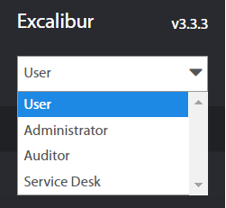

In spite of the fact that User might have a multiple User roles, everyone who is logged into the Dashboard, is logged under the User role by default. Regular User only sees own Actions and Sessions.

In Dashboard User Interface (UI) in the top left corner, there is a drop-down menu to choose among different User Roles assigned to the user. Each Role implies its own range of capabilities available in the Dashboard.

This manual is focused on capabilities available to the User role only.

User - is a person, an end-user who uses Excalibur to Authenticate and Authorize against Company’s Client(s) and integrations, utilizing personal Token, and if available on a given Client, manage own sessions. User might also Verify his/hers colleagues (if allowed and required), Reset own authentication factors, as well as expired password on a Client (if applicable). Every user can also log into the Dashboard, where a regular User only sees own Actions and Sessions.

As described above Regular User only sees own Actions and Sessions.

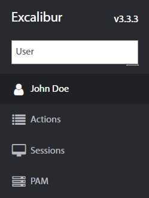

There are 4 different pages User may choose:

- Personal Overview                        
    - Sessions        
    - Actions
    - Incidents
    - Tokens
    - Computers
    - Accounts
    - Policies
    - Groups
    - Roles
    - Subordinates
    - Locations
- Actions
    - All
    - Authentication
    - Authorization
    - Verification
    - Registration
    - Factor reset
    - Tokenless Authentication
    - Show Password
    - Set geofence
- Sessions
    - Logged
    - Active
    - History
    - Manual
- PAM
    - Resources
    - Lists
    - File transfer
    - Fulltext search

## Sections Summary 

Personal Overview - Contains user’s Sessions, Actions, Incidents, Tokens, Computers, Accounts, Policies, Groups, Roles and Subordinates organized in tabs.

Actions - List of all Actions took by a user, such as Authentication, Authorization, Verification, Registration, Factor reset Tokenless Authentication, Show Password and Set geofence.

Sessions - List of all Logged, Active, and Manual sessions, as well as their History.

PAM - List of all PAM resources, which are available for users

## Personal Overview 

### Sessions 

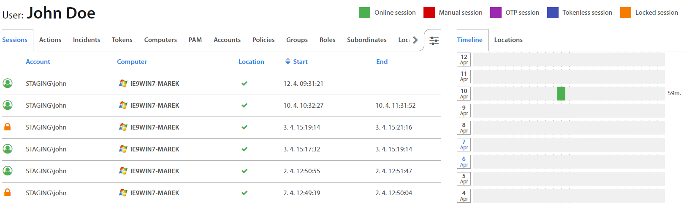

Personal Overview contains User’s Sessions, Actions, Incidents, Tokens, Computers, Accounts, Policies, Groups, Roles, Subordinates and Locations organized in tabs. In the Sessions tab, all User’s sessions with start and end times are listed.

### Actions 

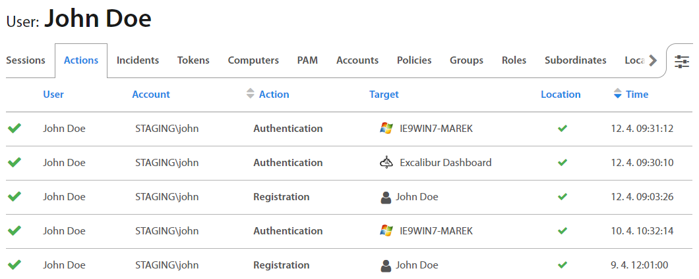

Actions tab shows all actions the User took or is currently taking, such as: Authentication, Authorization, Verification, Registration and Factor reset. Clicking on an individual Action detailed information with Verified factors, Token Used policy shows up. 

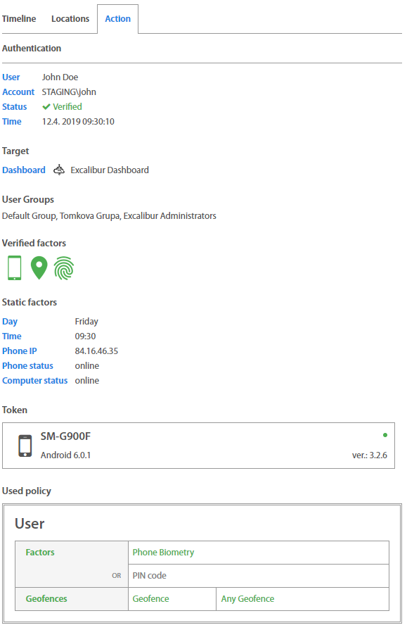

### Incidents {#h.yw9kon9s0kkf .c6 .c21}

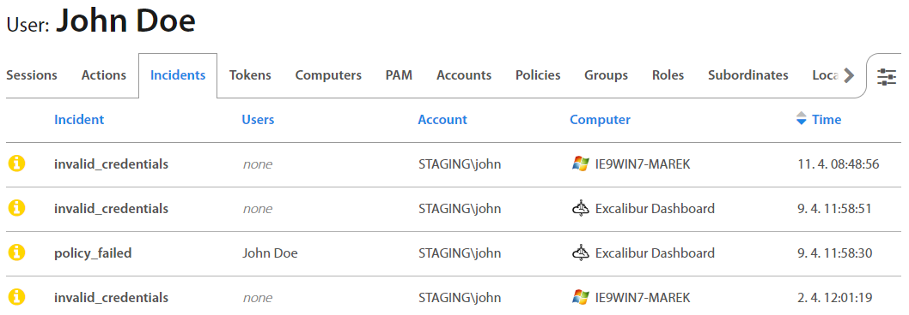

Incidents tab provides a list of all User’s Security Incidents (like Invalid credentials) for a review. Clicking on an individual Incident detailed information with Incident data shows up. Factors that failed are shown red so User may find out what was the reason for his / hers failed action.   

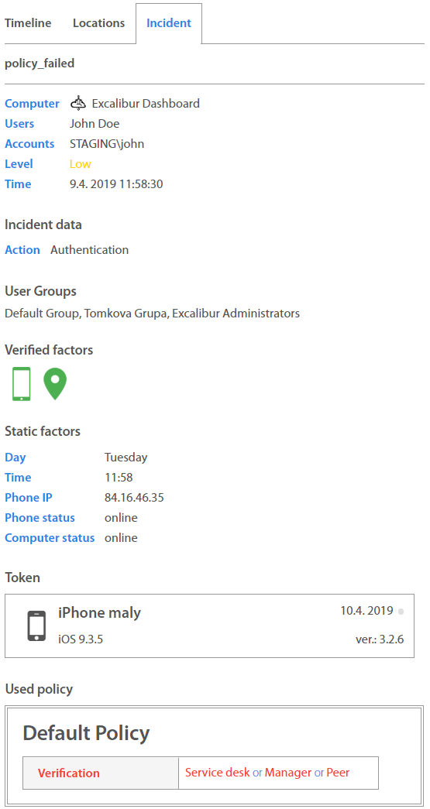

### Tokens 

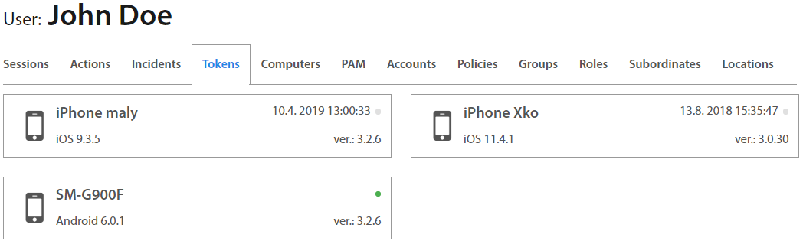

Tokens tab shows all registered tokens which the User has. A color dot next to the device name represents the token's online / offline state, and below it a mobile app version could be found.

### Computers 

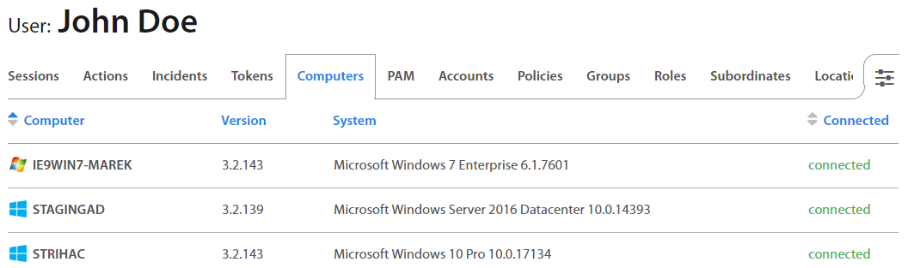

Computers tab contains all computers where the User was or is logged in. If the User is currently connected, status connected is indicated in green. If the User is already logged out, the last time of logout is shown in grey. By clicking on the computer name, the Computer detail page shows up.

### PAM 

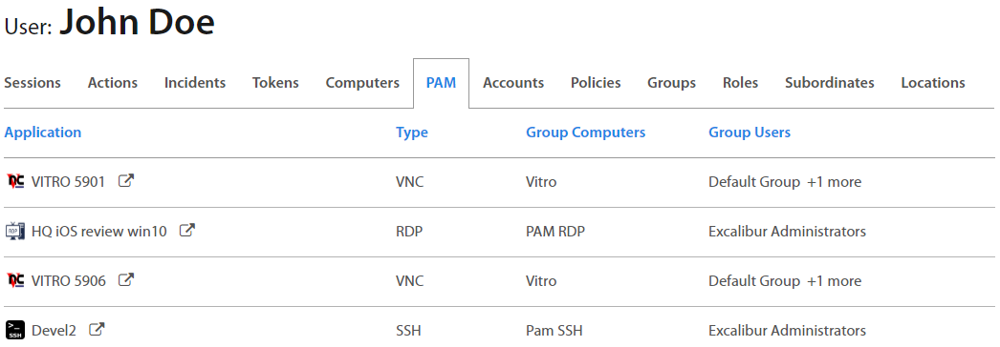

PAM tab contains all PAM resources which are assigned to the user and describes the type of PAM, group where is PAM resource assigned and user groups where is PAM resource assigned. By clicking on the icon or name of the PAM resource, PAM resource details show up. By clicking on button, PAM resource opens.

### Accounts  

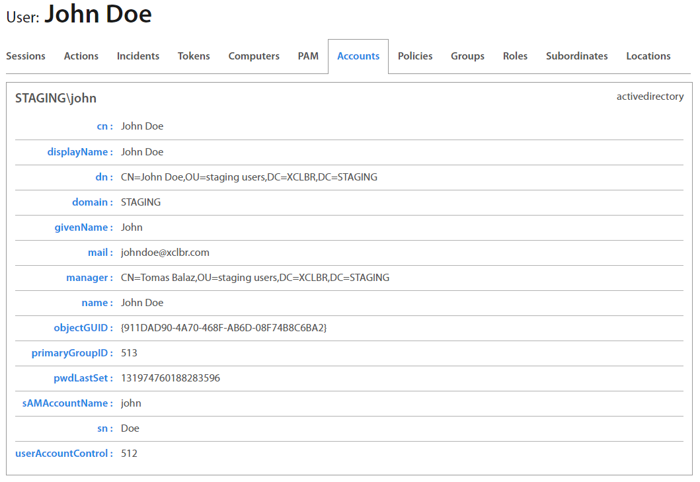

Accounts tab represents User’s Active Directory / LDAP account details as Excalibur sees them.

### Policies  

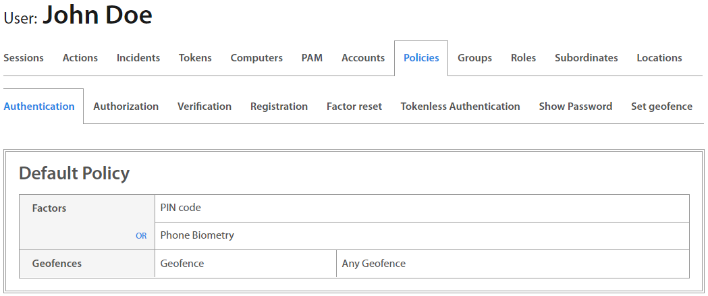

Policies tab serves to review security policies assigned to the User for every type of Action. With Excalibur, a different set of authentication factors or geofence rules could be set for every Excalibur Action.

### Groups & Roles

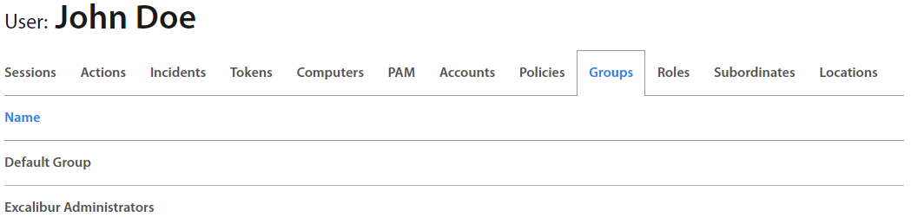

Groups show every group the User belongs to.

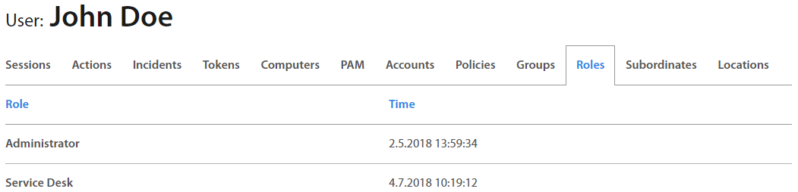

Roles lists all roles assigned to the User.

### Subordinates  

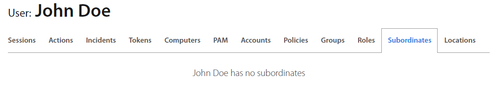

Subordinates tab lists all User’s subordinates in the company hierarchy
if User has some.

### Locations  

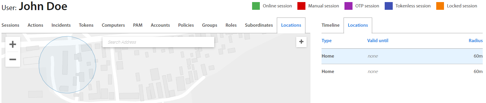

Locations tab contains the list of all User’s locations from where the User most probably will be logging into PC. User may define different locations like Home or Temporary location as well as define home location from user’s token. For Temporary location date until location will be valid might be specified. Locations can be added by clicking the “+” button and dragging the circle around the map. If needed to edit or delete location, click on circle by right mouse button or click on selected location in list and select the desired action. For Home locality can be changed position only and for Temporary location can be changed expiration date, radius and position. All changes of location have to be authorized with User’s token. Changes are confirmed via push notification which is received on token or by scanning the QR code    

## Actions 

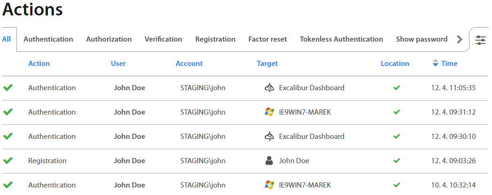

Actions page lists all actions took by User, such as Authentication, Authorization, Verification, Registration, Factor reset and Tokenless Authentication. By clicking on an individual Action, detailed information shows up. 

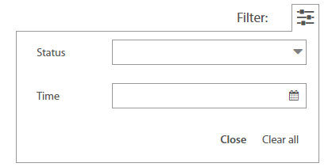

Filter in the top right corner enables a selection of a specific Status or Time of Action.

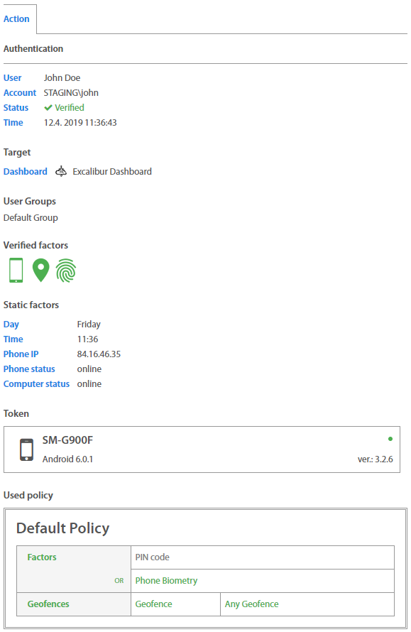

### Registration 

User needs to register first to perform any other action in Excalibur. Registration starts on a Client where User clicks “Register” on the Excalibur login screen and proceeds with self-registration following on-screen instructions. During registration User sets all authentication factors required by the security policy on his/hers Token, which initializes it.

### Authentication  

Authentication or Login is an intent-based action, and the only one in Excalibur which can operate in an online as well as offline mode. User performs his/hers intent by scanning a login QR code from a Client with his/hers Token. The login QR code is dynamically changing - by default Client generates a new one every 15 seconds with 90 seconds validity. Authentication factors are then verified based on the security policy and if it succeeds, in online mode the User is automatically logged into the Client, while in offline mode, the User is presented on his/hers Token with an OTP code, which he/she needs to enter in the Client’s Excalibur login screen to log in.

### Authorization 

Authorization or Action Confirmation is a push notification based action, for example VPN Login (in which a username needs to be entered) will trigger a push notification for a Token of a User specified by the username. On the Token the User is asked to confirm given action with exact specification of what is being confirmed. Authentication factors are then verified based on the security policy and if it succeeds, User’s action is authorized. RADIUS is currently the primary use-case of Authorization.

### Factors Reset 

Registered Users have an option to reset their authentication factors on their Tokens. Firstly, authentication factors are verified based on the security policy and if it succeeds, User proceeds to set new factors.

### Verification 

In case of verification a User with appropriate privileges, e.g. Manager (Verifier) using his/hers Token confirms another User's (Initiator) identity and action. Verification begins either directly by scanning a verification QR code from initiator’s Token, or by receiving a push notification, or via Dashboard. Verification can be configured in the security policy as a required action for any Basic Action or any policy violation. Basic Action’s flow is then modified to accommodate the Verification after the usual authentication factors verification succeeds on the Initiator’s side. If successful, the Verifier is prompted to confirm the action using his/hers authentication factors on his/hers Token. Also, every security policy change requires a verification of the change by the Administrator.

### Tokenless Authentication 

If a User forgets his/hers Token, or there’s any other reason a User cannot use or doesn’t have his/hers Token at the moment, there’s a backup option to utilize a Tokenless Authentication. In this case, User begins the process on Client’s Excalibur Login screen, selects “Forgotten phone”, inserts his/hers name, PIN and a reason why his/hers Token isn’t available at the moment. If entered name and pin are verified successfully, this request triggers a usual Verification process in which any verifier designated to verify this User based on the security policy, verifies the action either in person or remotely. Based on the user's policy, verifiers have the option to select a time interval on theirs tokens during which the user can login without further verification on a particular computer. For further tokenless login on this computer, User must type username, PIN and give the reason\
For instance:\
Let’s say that User’s tokenless duration is set up to 8 hours. If user clicks on Tokenless button and types username, PIN and reason, verification QR code on CPUI screen will be shown. Verifier scans this QR and provides authentication factors and select duration to one hour on token. Now, User can make further Tokenless logins without verification on this computer. In this time interval, user will type username, PIN and the reason only.

In case that login is verified by peers, the duration is set by peer who sets duration as the second in order.

### Show Password 

Registered Users have an option to display their password on their registered token. If Show Password is allowed by the company's security policy, then User can display own password. On the Show Password tab,  all Show password actions are recorded.

### Set geofence  

Each user who uses Excalibur has an option to set own home or temporary location by token or dashboard. In the Set geofence tab, all changes of geofence and locations are recorded.

## Sessions 

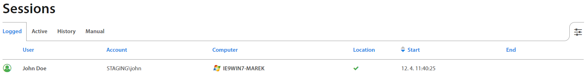

In Sessions, all Logged, Active, and Manual sessions are located, as well as their History.

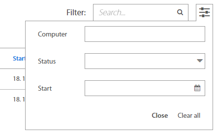

It’s also possible to filter Sessions by Computer, Status or Start time in the top right corner.

## PAM  

PAM - provides web-based access to Enterprise resources – either directly acting as a HTML5 to other protocols proxy server (RDP, SSH, Telnet, VNC or even Browser access) or via dynamic port-forwarding that enables native clients such as RDP to access resources on the internal network via port forwarding on Excalibur PAM.

Excalibur PAM considers all sessions “privileged” and by default recorded. Every action taken by the user is cryptographically signed to certify it was performed by the authenticated user. The effect of this is that there is continuous matching of every user action (as every user action and user PAM session is recorded and cryptographically signed) to strongly multi-factor authenticated identity. With no way to delegate access or claim it was some other user.

For detailed information about PAM please see Excalibur PAM Manual document.

### Resources  

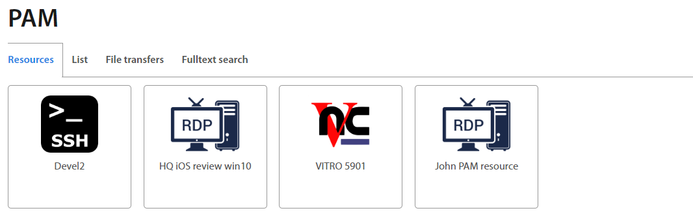

Resources tab - shows all Applications which are assigned to the user's account. By clicking on the desired icon, the selected connection will be opened in a new tab.

### List  

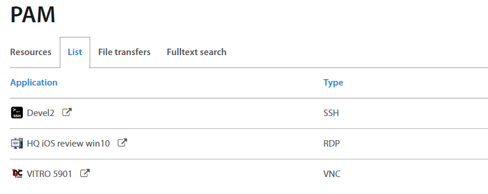

List tab - shows all assigned resources and their type. If user clicks on  button, the connection will be established. By clicking on a specific application, further details will be shown (see section Application Details).

### List: Sessions 

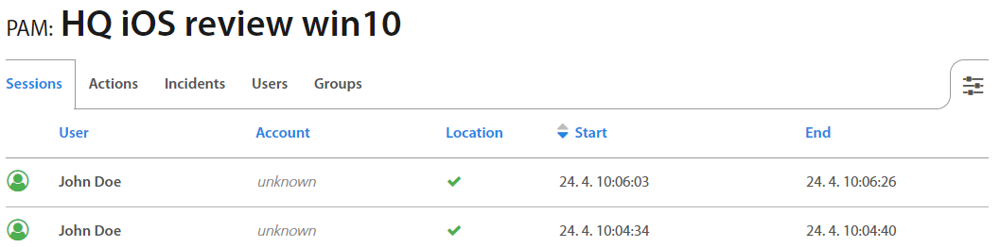

Sessions tab lists all the past and active user sessions as well as their start / end time. All PAM sessions are by default recorded. By hovering over specified session, the button shows up. Click on to play the session.

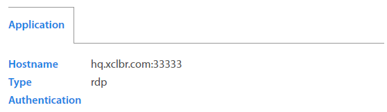

On the right hand are informations about connection of PAM application

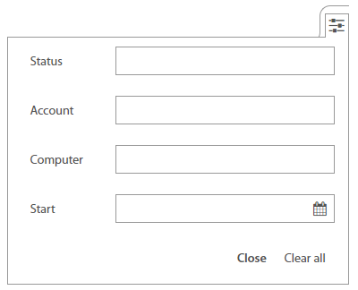

It’s also possible to filter Sessions by Account, Computer, Status or Start time in the top right corner.

### List: Actions & Incidents  

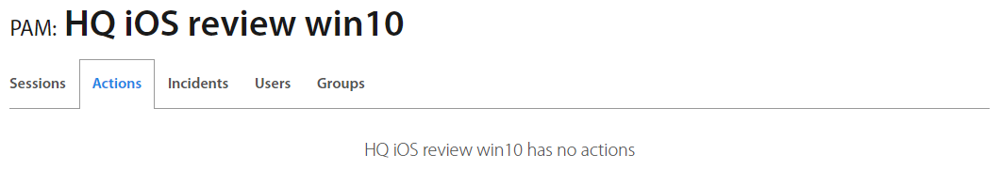

Actions tab lists all actions if the PAM resource requires some actions. By clicking on the action, the action details show up.

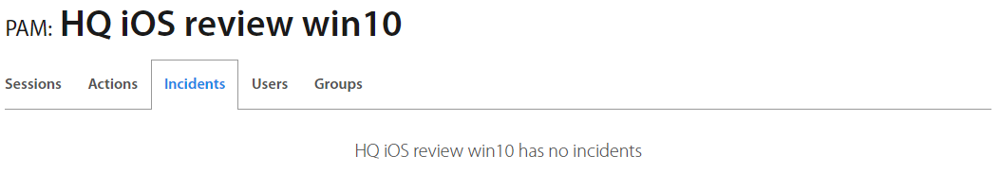

Incidents tab lists all incidents which occurred during opening the PAM application. By clicking on the incident, the incident details show up.

### List: Users  

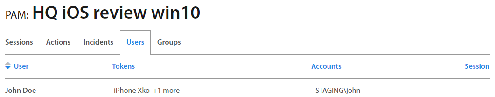

Users tab lists all users' details who use the PAM application. By clicking on the user, the user's details show up. By clicking on the token, the token's details show up. By clicking on account, the account's details show up. If the PAM session is active, then the sessions column shows the duration of session.

### List: Groups 

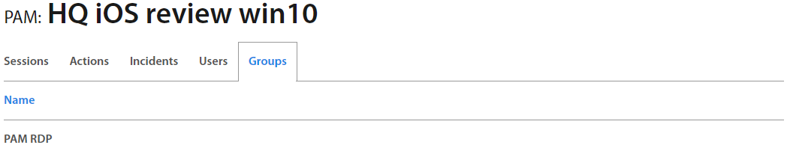

Group tab lists groups where PAM resources are assigned. By clicking on the group, the group details show up.

### File transfers 

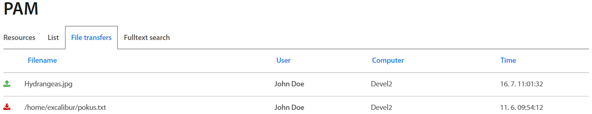

Excalibur PAM displays all transferred files by users in PAM sessions. Each role has presetted rules to show transferred files. Users have access to their own files only. By clicking on the specific file or ,button, the file is downloaded immediately. By clicking on the user name or client, further information is shown.

### Full Text search  
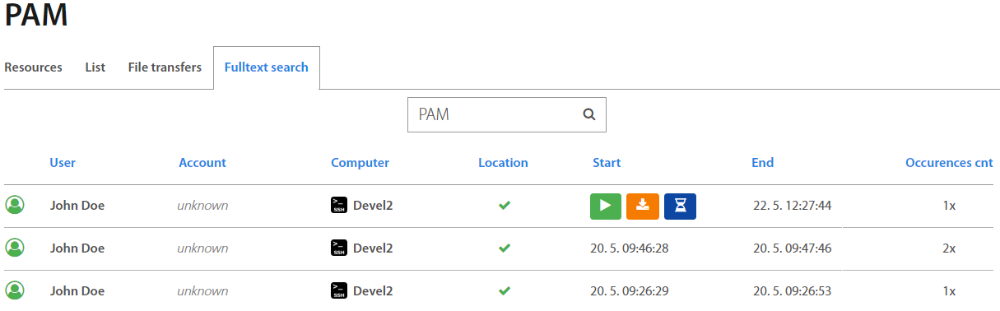

Excalibur PAM allows to find a full word which is inserted by the user during the PAM session. Each role has presetted rules of searching. Users can search in own sessions only. Type required word to search bar and  sessions with required word are shown immediately. Hover by mouse cursor over required session and click on the  button, to run the required session.

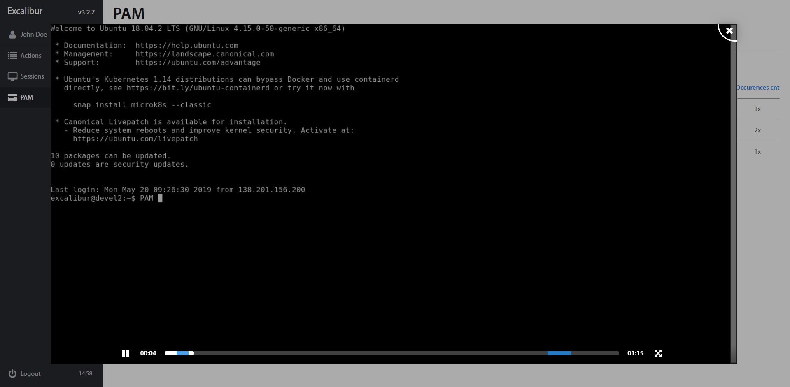

Blue highlighted interval on the timeline is the place of the required keyword you search.

