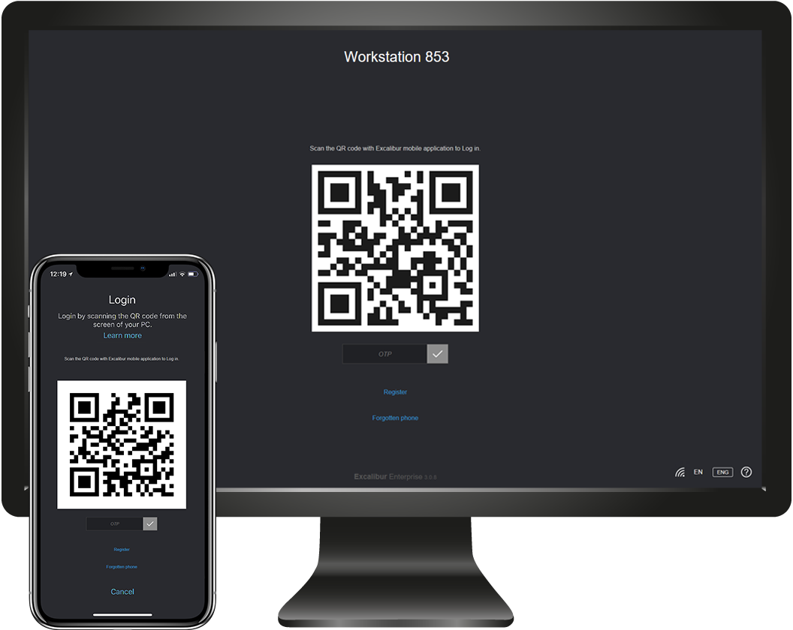
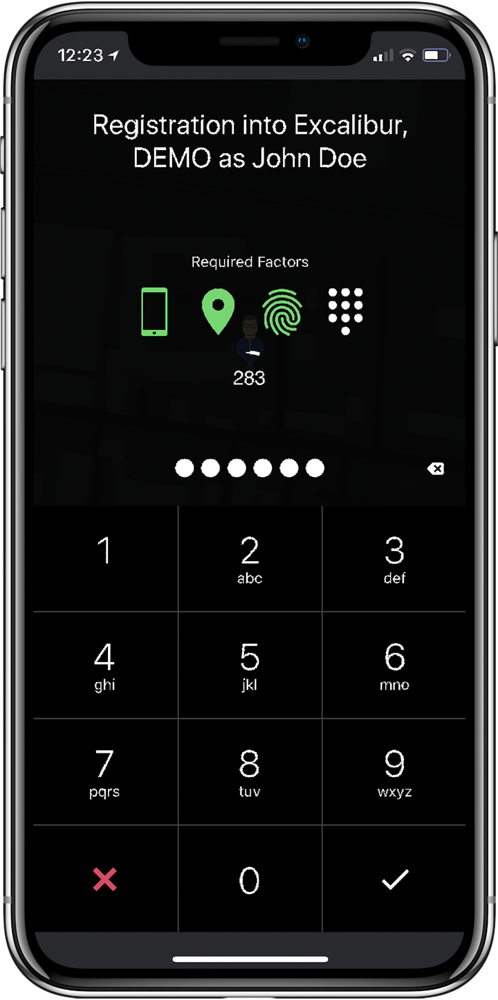
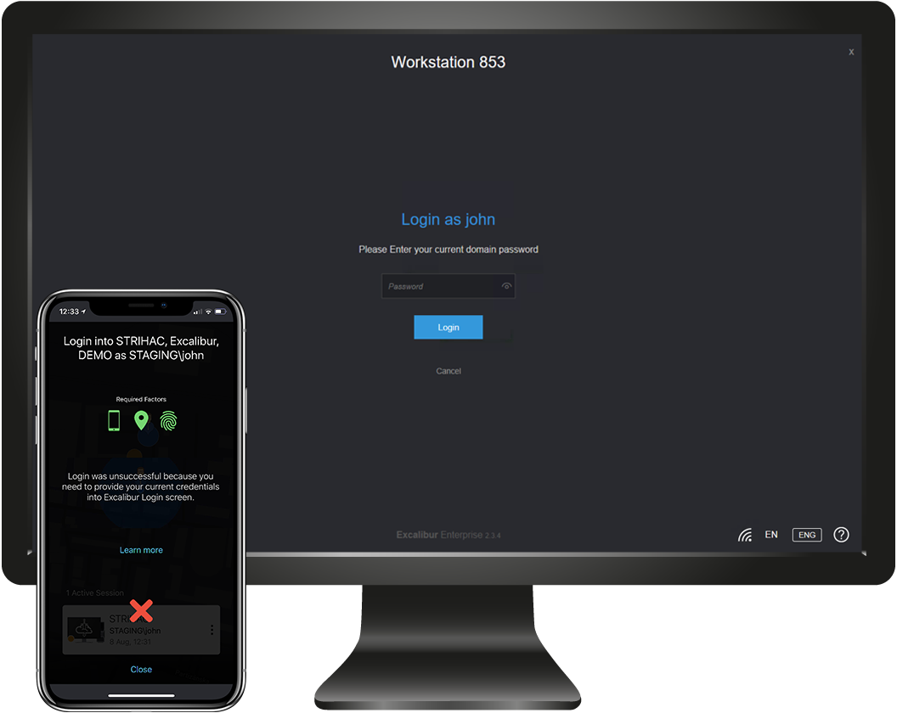
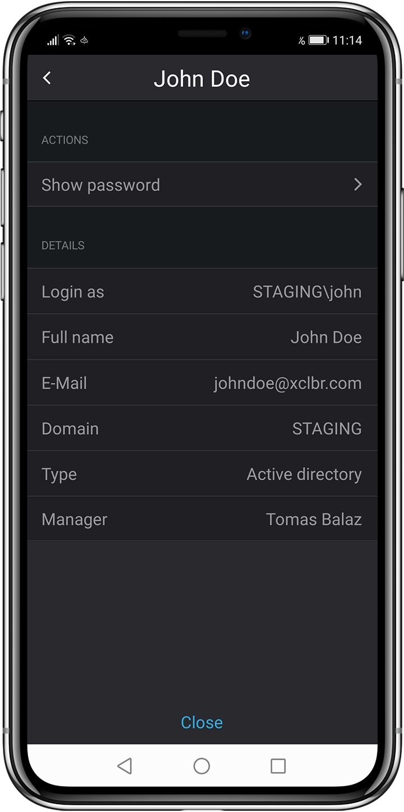

# Excalibur User manual

## Excalibur

Excalibur acts as security token for passwordless authentication using your mobile phone to verify authentication factors such as Location, PIN, Fingerprint, Face ID, etc.

To start using Excalibur you need to install Excalibur mobile phone application first. Please download it from [https://getexcalibur.com/get](https://www.google.com/url?q=https://getexcalibur.com/get&sa=D&ust=1595850862589000&usg=AOvVaw2tsX8XCv5LVkj8ObnMW-V_) and proceed with 2. Registration

### Excalibur login screen

Excalibur login screen is simple User Interface which core component is dynamically changing QR code.

From login screen you may:

1.  Login to your PC
2.  Self-Register into Excalibur
3.  Check Excalibur Server connection status
4.  Connect to networks or VPN adapters
5.  Switch language
6.  Switch keyboard settings
7.  Open built-in Help section for better User Experience

## Registration

Registration is a process of creating a unique link between the phone (identity) and Excalibur server (company). Setting authentication factors (such as PIN, biometric factors or location) is part of a registration process.

Registration is done by self-registration from a computer with Excalibur login screen

### Self-Registration from the PC Login screen

1.  Click “Register” on your computer’s Login screen (If there is only small QR code on your computer’s screen you can always click on it to maximize the Excalibur Login screen)
2.  Fill in your username, password and click “Register”
3.  Open Excalibur phone application and scan the QR code from computer’s screen
4.  Confirm registration on your phone by clicking “Register”
5.  Continue to 2.2 Setting factors

### Setting factors

As a part of a registration, you are required to set your authentication factors. You will be asked to allow device location detection.

1.  Scan your fingerprint or provide Face ID (if available)
2.  Create your PIN code which will be used to confirm actions using
    Excalibur

## Login

Excalibur acts as a security token for passwordless authentication.

For logging in you just:

1.  Scan the Login QR with Excalibur mobile application
2.  Confirm by providing required authentication factors (PIN, fingerprint or Face ID)
3.  Computer should log you in automatically

Excalibur enables you to do multiple types of logins:

    3.1. Online Login
    3.2. OTP Login
    3.3. Login without Phone

If there is only small QR code on your computer’s screen you can always click on it to maximize the Excalibur Login screen

### Online Login

When both your computer and your phone are online Excalibur executes Online Login which after confirming authentication factors logs you in automatically

1. Scan the Login QR from the screen of your computer with Excalibur mobile phone application
2. Confirm by providing required authentication factors (PIN, Fingerprint, Face ID)
3. Computer should log you in automatically, if not:
    1. Continue to 3.1.1 Static Password, if Excalibur asks for your current password
    2. Continue to 3.1.2 Expired Password, if your password is expired and Excalibur asks for a new password
    3. Continue to 3.2 OTP Login if Excalibur generates OTP code. When PC and Token are in the same network, the token tries to send data via SSDP protocol

#### Static password

During login Excalibur might ask you for your current User password. In
that case:

1.  Fill in your current User password
2.  Click the “Login” button
3.  Computer should log you in automatically

#### Expired password

When your password is expired due to your company’s password policy Excalibur might ask you for the new password. In that case:

1.  Fill in your current User password
2.  Fill in your new User password
3.  Confirm by clicking the “Change” button
4.  Computer should log you in automatically

### OTP Login

When your phone or your PC is offline, the Excalibur application might generate short OTP code with expiration instead of logging you in automatically. In that case:

1.  Retype the OTP code into OTP field of your computer’s screen
2.  Confirm by pressing “ENTER” key on your keyboard or click on confirmation button

### Login without Phone

When you forget your phone you might still log into the computer using Excalibur

1.  Click on “Forgotten phone” button on your computer’s login screen
2.  Fill in your username, Excalibur PIN code and the reason why you can’t use Excalibur mobile phone application to log in
3.  Confirm by clicking the “Login” button
4.  Wait for the Administrator, Service Desk operator, peer or your superior to confirm the Login
5.  Based on user’s policy, verifiers have the option to select period on theirs tokens  during which the user can logs without further verification. User just types username, PIN and the reason in this selected period.

## Confirming action

When accessing services like VPN, SIP clients, or websites Excalibur might ask you for additional confirmation via notification:

1.  Verify the action that is being executed
2.  Confirm or cancel the action
3.  Provide required authentication factors (PIN, fingerprint or Face ID)

## Phone application 

Excalibur application lets you log into computers and confirm actions without password just by using authentication factors

Application entry point is map screen with phone’s current location and list of active sessions. In case of no active sessions, QR scanner is started automatically.

### Main Application Menu:

History - detailed list of all authenticated sessions (5.2)

Scanner - scanner for all supported QRs (login, register, …)

Settings - list of all registered companies (identities) with appropriate actions (5.3)

### Session termination (lock/logout)

Excalibur always shows you all your active sessions and enables you to lock / logout them even if you are away from the computer

For the lock/logout just:

1.  Choose the session from session list
2.  Click on  button
3.  Select “Lock” or “Logout”

For the unlock/logout just:

4.  Choose the session from session list
5.  Click on  button
6.  Select “Unlock” or “Logout”

Unlock option is only available at the location of last performed login. In case that User changed location, he / she has to scan the QR code again to be able to log in.

### Sessions history

Excalibur lets you inspect your session history

1.  Click on the Session History button on the left side of bottom panel 
2.  Scroll through your session history or change the month
3.  Select specific session to see it on map and see session details

### Reset PIN

When you want to change your PIN code simply:

1.  Click on application settings 
2.  Click on “Reset PIN”
3.  Confirm by providing required authentication factors (PIN, fingerprint, Face ID)
4.  Enter your new PIN code

 

If it is necessary to reset PIN, then it is also necessary to provide all required verification’s factors /Fingerprint or FaceID/ and PIN. In some cases both factors can be required.

### Show password

Excalibur application provides to display your password on your registered phone. This option can be enabled or disabled by company's security policies.

1.  Click on application settings 
2.  Click on your company
3.  Click on your account
4.  Select “Show password”
5.  Provide authentication factors

### Home locations

To allow work from home scenarios it is possible to set home locations for login to PC Client. By default, Security policy doesnot allow Set location. 

Add Locations

1.  Click on application settings         
2.  Select “Home geofences”.
3.  Search your address using “Search address” bar, search result will be displayed on the map.
4.  Tap on selected place and confirm by “Add geofence”.
5.  Provide required factors

 Remove Locations

1.  Navigate to “Home geofences”.
2.  Select location which you want to delete and click on it.
3.  For confirm click on “Remove geofence”

If company's policy limits the number of defined Home geofences and the user tries to define more than allowed a warning will be displayed.

### Report a problem

If you have any problem with Excalibur application, you have an option to send report with problem

1.  Click on application settings  button
2.  Scroll screen
3.  Click on “Report a problem”
4.  Type  your email if you want to be contacted by developer
5.  Describe your problem and send report with “Send” button at right top.
6.  To send a report, "Usage & Diagnostics" has to be enabled.  If not, application asks you to allow it. 

### Usage & Diagnostics

If some eroor occurred, applications allows to sent Token's logs to vedndor.

1.  Click on application settings  button
2.  Click on "Usage & Diagnostics" and enable it

### Map Theme

Since version 3.2.7, Excalibur application provides option to set the colour of Map theme on main screen of application and colour of Map on Home geofences.

1.  Click on application settings 
2.  Click on Map Theme
3.  Select required theme

### Run on background & Vibration

Excalibur application provides option to disable / enable Run on background and Vibrations. By default, these settings are enabled.

Run on background

1.  Click on application settings 
2.  Click on “Background running” button
3.  Click on Disable

Vibrations

1.  Click on application settings 
2.  Click on “Vibration” button

Note: Run on background improves better app speed when launches. App doesn’t collect any data on background.

### Termination of App

To close application follow steps

1.  Click on application settings  and scroll down
2.  Click on “Exit App” button
3.  Confirm Exit

## Verifying co-workers

When you need to verify your co-worker e.g. in case of PIN reset or login:

1.  Scan the QR code generated by your co-worker
2.  Verify his identity, executed action and click “Verify”
3.  Confirm by providing required authentication factors (PIN,
    fingerprint, Face ID)

PIN verification was successful.

### Peer verification

Peer verification is special type of action when two peers confirm action of theirs colleague and can be used for each action of Excalibur.